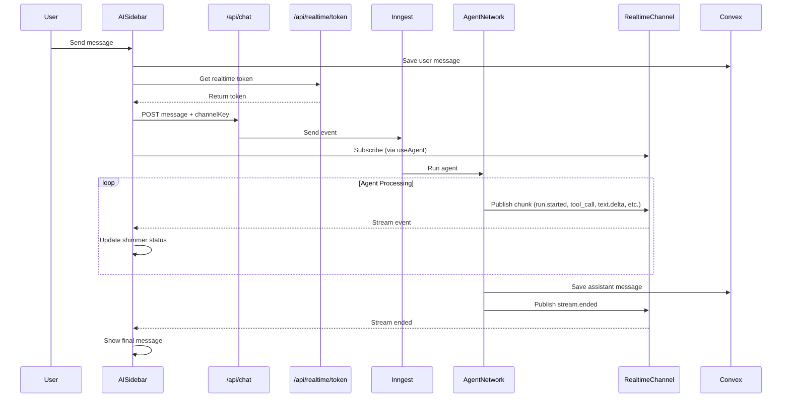

# Design Document: AI Chat Streaming

## Overview

This design implements real-time streaming for the AI chat workflow using Inngest AgentKit's streaming capabilities. The solution replaces the current polling-based approach with WebSocket-based streaming, providing users with live feedback during agent execution through a shimmer animation that displays status updates.

The architecture follows AgentKit's recommended pattern:

1. Inngest client with realtime middleware publishes agent events to a channel
2. React frontend subscribes via the `useAgent` hook
3. Events are mapped to UI states and displayed via the Shimmer component

## Architecture



## Components and Interfaces

### 1. Inngest Client with Realtime Middleware

**File:** `inngest/client.ts`

```typescript
import { Inngest } from "inngest";
import { realtimeMiddleware } from "@inngest/realtime";

export const inngest = new Inngest({
  id: "unit-set",
  isDev: process.env.NODE_ENV === "development",
  middleware: [realtimeMiddleware()],
});
```

### 2. Realtime Channel Definition

**File:** `inngest/realtime.ts`

```typescript
import { channel, topic } from "@inngest/realtime";
import type { AgentMessageChunk } from "@inngest/agent-kit";

export const createChannel = channel(
  (screenId: string) => `screen:${screenId}`
).addTopic(topic("agent_stream").type<AgentMessageChunk>());
```

### 3. Token Endpoint

**File:** `app/api/realtime/token/route.ts`

```typescript
interface TokenRequest {
  channelKey: string;
}

interface TokenResponse {
  token: string;
}
```

### 4. Updated Chat API

**File:** `app/api/chat/route.ts`

```typescript
interface ChatRequest {
  message: string;
  screenId: string;
  projectId: string;
  channelKey: string; // New field for streaming
}
```

### 5. Streaming Status Mapper

**File:** `lib/streaming-utils.ts`

```typescript
type StreamingStatus = "ready" | "submitted" | "streaming" | "error";

interface StreamingState {
  status: StreamingStatus;
  statusText: string;
  isConnected: boolean;
}

function mapEventToStatus(event: AgentKitEvent): StreamingState;
function getStatusTextForEvent(event: AgentKitEvent): string;
```

### 6. Streaming Indicator Component

**File:** `components/canvas/StreamingIndicator.tsx`

```typescript
interface StreamingIndicatorProps {
  statusText: string;
  isVisible: boolean;
}
```

### 7. Updated AISidebar

**File:** `components/canvas/AISidebar.tsx`

- Integrates `useAgent` hook for streaming
- Manages channel subscription lifecycle
- Renders StreamingIndicator during agent processing
- Falls back to Convex polling when disconnected

## Data Models

### AgentKit Event Types

```typescript
type AgentKitEventType =
  | "run.started"
  | "run.completed"
  | "stream.ended"
  | "part.created"
  | "text.delta"
  | "part.completed"
  | "tool_call.arguments.delta"
  | "tool_call.output.delta";

interface AgentKitEvent {
  event: AgentKitEventType;
  data: {
    runId?: string;
    delta?: string;
    toolName?: string;
    type?: string;
    error?: string;
  };
}
```

### Client State

```typescript
interface ClientState {
  screenId: string;
  projectId: string;
}
```

### Chat Input Status

```typescript
type ChatInputStatus = "submitted" | "streaming" | "ready" | "error";
```

## Correctness Properties

_A property is a characteristic or behavior that should hold true across all valid executions of a system-essentially, a formal statement about what the system should do. Properties serve as the bridge between human-readable specifications and machine-verifiable correctness guarantees._

Based on the prework analysis, the following properties have been identified:

### Property 1: Shimmer displays during streaming status

_For any_ chat state where status is "streaming", the UI should render the shimmer component with a non-empty status text.

**Validates: Requirements 1.1**

### Property 2: Tool call events produce tool-specific status text

_For any_ tool_call event with a toolName, the generated status text should contain a human-readable form of that tool name.

**Validates: Requirements 1.3**

### Property 3: Status text length constraint

_For any_ AgentKit event type, the generated status text should be at most 30 characters in length.

**Validates: Requirements 4.3**

### Property 4: Event-to-state mapping completeness

_For any_ valid AgentKit event type (run.started, text.delta, tool_call.arguments.delta, tool_call.output.delta, part.completed, run.completed, stream.ended), the event mapper should return a valid StreamingStatus (ready, submitted, streaming, or error).

**Validates: Requirements 5.3, 5.4**

## Error Handling

### Connection Failures

1. **WebSocket Disconnection**: The `useAgent` hook's `isConnected` state triggers fallback to Convex polling
2. **Token Fetch Failure**: Display error toast and continue with polling-based updates
3. **Streaming Error Event**: Show error indicator with retry button

### Graceful Degradation

```typescript
// In AISidebar
const { isConnected, status } = useAgent({ ... });

// If not connected, rely on Convex subscription for messages
const convexMessages = useQuery(api.messages.getMessages, { screenId });

// Merge streaming messages with Convex messages for consistency
const displayMessages = isConnected ? streamingMessages : convexMessages;
```

### Error Recovery

- Automatic reconnection handled by `useAgent` hook
- Manual retry via error button triggers new message send
- Message persistence in Convex ensures no data loss

## Testing Strategy

### Dual Testing Approach

This feature requires both unit tests and property-based tests:

**Unit Tests** verify specific examples:

- Token endpoint returns valid token for authenticated users
- Token endpoint rejects unauthenticated requests
- Chat API includes channelKey in Inngest event
- Specific event types map to expected status text

**Property-Based Tests** verify universal properties:

- All tool names produce valid status text
- All status text respects length constraint
- All event types produce valid UI states

### Property-Based Testing Library

**Library:** `fast-check` (TypeScript property-based testing)

**Configuration:** Minimum 100 iterations per property test

### Test File Structure

```
lib/
  streaming-utils.ts
  streaming-utils.test.ts  # Unit tests + property tests
components/canvas/
  StreamingIndicator.tsx
  StreamingIndicator.test.tsx  # Component tests
app/api/realtime/token/
  route.ts
  route.test.ts  # API endpoint tests
```

### Property Test Annotations

Each property-based test must include:

```typescript
// **Feature: ai-chat-streaming, Property 1: Shimmer displays during streaming status**
// **Validates: Requirements 1.1**
```

## Dependencies

The following packages are already installed in the project:

- `@inngest/agent-kit` - AgentKit framework with streaming support
- `@inngest/realtime` - Realtime middleware for WebSocket streaming
- `@inngest/use-agent` - React hook for consuming streaming events in the frontend
