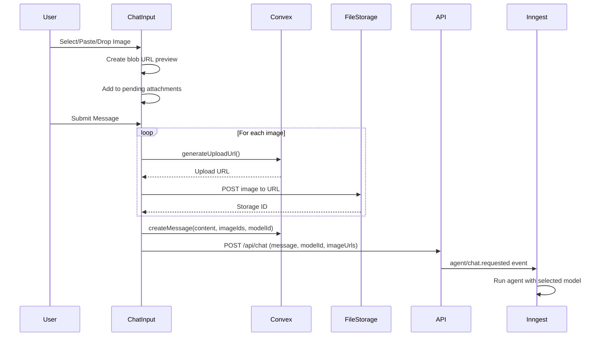

# Design Document: AI Model Selection & Image Upload

## Overview

This feature enhances the AI chat sidebar with two key capabilities:

1. **Model Selection**: Users can choose from multiple AI models (OpenAI GPT, Anthropic Claude, Google Gemini, xAI Grok) via a searchable dropdown in the chat input.

2. **Image Upload**: Users can attach images to messages via file picker, paste, or drag-and-drop. Images are stored in Convex file storage and sent to vision-capable models for analysis.

The implementation leverages existing UI components (`ModelSelector`, `PromptInputAttachment`) and integrates with the current Inngest/OpenRouter architecture.

## Architecture

```mermaid
flowchart TB
    subgraph Frontend
        AISidebar[AISidebar Component]
        ChatInput[ChatInput Component]
        ModelSelector[ModelSelector]
        ImageAttachments[Image Attachments]
    end

    subgraph State
        SelectedModel[Selected Model State]
        PendingImages[Pending Images State]
    end

    subgraph ConvexBackend[Convex Backend]
        FileStorage[File Storage]
        Messages[Messages Table]
        GenerateUploadUrl[generateUploadUrl Mutation]
        SendImage[sendImage Mutation]
    end

    subgraph InngestWorkflow[Inngest Workflow]
        ChatAPI[/api/chat]
        RunChatAgent[runChatAgent Function]
        OpenRouter[OpenRouter API]
    end

    ChatInput --> ModelSelector
    ChatInput --> ImageAttachments
    ModelSelector --> SelectedModel
    ImageAttachments --> PendingImages

    ChatInput -->|Submit| GenerateUploadUrl
    GenerateUploadUrl -->|Upload URL| FileStorage
    FileStorage -->|Storage ID| SendImage
    SendImage --> Messages

    ChatInput -->|Message + Model + Images| ChatAPI
    ChatAPI --> RunChatAgent
    RunChatAgent -->|Model ID| OpenRouter
```

## Components and Interfaces

### 1. Model Configuration

```typescript
// lib/ai-models.ts
export interface AIModel {
  id: string; // OpenRouter model ID (e.g., "openai/gpt-4o")
  name: string; // Display name (e.g., "GPT-4o")
  provider: string; // Provider name (e.g., "OpenAI")
  providerSlug: string; // For logo lookup (e.g., "openai")
  supportsVision: boolean;
}

export const AI_MODELS: AIModel[] = [
  // xAI (default)
  {
    id: "x-ai/grok-4.1-fast:free",
    name: "Grok 4.1 Fast",
    provider: "xAI",
    providerSlug: "xai",
    supportsVision: true,
  },

  // OpenAI
  {
    id: "openai/gpt-4.1",
    name: "GPT-4.1",
    provider: "OpenAI",
    providerSlug: "openai",
    supportsVision: true,
  },

  // Anthropic
  {
    id: "anthropic/claude-opus-4.5",
    name: "Claude Opus 4.5",
    provider: "Anthropic",
    providerSlug: "anthropic",
    supportsVision: true,
  },

  // Google
  {
    id: "google/gemini-3-pro-preview",
    name: "Gemini 3 Pro",
    provider: "Google",
    providerSlug: "google",
    supportsVision: true,
  },
];

export const DEFAULT_MODEL_ID = "x-ai/grok-4.1-fast:free";

export function getModelById(id: string): AIModel | undefined {
  return AI_MODELS.find((m) => m.id === id);
}

export function getModelsByProvider(): Record<string, AIModel[]> {
  return AI_MODELS.reduce((acc, model) => {
    if (!acc[model.provider]) acc[model.provider] = [];
    acc[model.provider].push(model);
    return acc;
  }, {} as Record<string, AIModel[]>);
}
```

### 2. Updated ChatInput Component

```typescript
// components/canvas/AISidebar.tsx - ChatInput section
interface ChatInputProps {
  onSubmit: (
    message: PromptInputMessage,
    options: {
      modelId: string;
      images: ImageAttachment[];
      extensionData?: CapturedElement;
    }
  ) => void;
  status: ChatInputStatus;
}

interface ImageAttachment {
  id: string;
  file: File;
  previewUrl: string; // Blob URL for preview
  storageId?: string; // Convex storage ID after upload
}
```

### 3. Convex Schema Updates

```typescript
// convex/schema.ts - Updated messages table
messages: defineTable({
  screenId: v.id("screens"),
  role: v.union(v.literal("user"), v.literal("assistant")),
  content: v.string(),
  modelId: v.optional(v.string()),  // NEW: Model used for this message
  imageIds: v.optional(v.array(v.id("_storage"))),  // NEW: Attached image storage IDs
  createdAt: v.number(),
}).index("by_screenId", ["screenId"]),
```

### 4. Convex Mutations for Image Upload

```typescript
// convex/messages.ts
export const generateUploadUrl = mutation({
  handler: async (ctx) => {
    return await ctx.storage.generateUploadUrl();
  },
});

export const getImageUrl = query({
  args: { storageId: v.id("_storage") },
  handler: async (ctx, args) => {
    return await ctx.storage.getUrl(args.storageId);
  },
});
```

### 5. Updated Chat API Route

```typescript
// app/api/chat/route.ts - Extended schema
const useAgentDirectSchema = z.object({
  userMessage: z.object({
    id: z.string(),
    content: z.string(),
    role: z.enum(["user"]),
    state: z.record(z.string(), z.unknown()).optional(),
  }),
  modelId: z.string().optional(), // NEW
  imageUrls: z.array(z.string()).optional(), // NEW: Base64 data URLs
  // ... existing fields
});
```

### 6. Updated Inngest Function

```typescript
// inngest/functions.ts - Dynamic model selection
const openrouter = (config: { model: string }) =>
  openai({
    model: config.model,
    apiKey: process.env.OPENROUTER_API_KEY,
    baseUrl: "https://openrouter.ai/api/v1",
  });

// In runChatAgent:
const modelId = event.data.modelId || DEFAULT_MODEL_ID;
const imageUrls = event.data.imageUrls || [];

// Format message with images for vision models
const messageContent =
  imageUrls.length > 0
    ? [
        { type: "text", text: message },
        ...imageUrls.map((url) => ({ type: "image_url", image_url: { url } })),
      ]
    : message;

const chatAgent = createAgent<AgentState>({
  // ...
  model: openrouter({ model: modelId }),
  // ...
});
```

## Data Models

### Image Attachment Flow



### Message with Images

```typescript
interface MessageWithImages {
  _id: Id<"messages">;
  screenId: Id<"screens">;
  role: "user" | "assistant";
  content: string;
  modelId?: string;
  imageIds?: Id<"_storage">[];
  createdAt: number;
}
```

## Correctness Properties

_A property is a characteristic or behavior that should hold true across all valid executions of a system-essentially, a formal statement about what the system should do. Properties serve as the bridge between human-readable specifications and machine-verifiable correctness guarantees._

### Property 1: Model selection state consistency

_For any_ model selection action, the selected model state SHALL update to match the selected model ID, and the UI SHALL reflect the new model name and provider logo.
**Validates: Requirements 1.3**

### Property 2: Selected model routing

_For any_ message sent with a selected model, the API request to Inngest SHALL include the selected model ID, and the agent SHALL be configured with that model.
**Validates: Requirements 1.4**

### Property 3: Image attachment display

_For any_ valid image file added to attachments (via file picker, paste, or drag-drop), the system SHALL display a chip with a thumbnail preview and the filename.
**Validates: Requirements 2.2, 2.5, 2.6**

### Property 4: Image removal

_For any_ image in the pending attachments list, clicking the remove button SHALL remove that specific image from the list and revoke its blob URL.
**Validates: Requirements 2.4**

### Property 5: Image upload persistence

_For any_ message submitted with images, each image SHALL be uploaded to Convex file storage, and the resulting storage IDs SHALL be stored in the message record.
**Validates: Requirements 3.1, 3.2**

### Property 6: Image retrieval from history

_For any_ message with stored image IDs, loading the conversation history SHALL retrieve the image URLs and display thumbnails alongside the message text.
**Validates: Requirements 3.3, 3.4**

### Property 7: Vision model image inclusion

_For any_ message with images sent to a vision-capable model, the API request SHALL include the image data as base64 data URLs with correct MIME types.
**Validates: Requirements 4.1, 4.3**

### Property 8: Non-vision model warning

_For any_ message with images where the selected model does not support vision, the system SHALL display a warning indicating images may not be processed.
**Validates: Requirements 4.2**

## Error Handling

### Image Upload Errors

| Error                       | Handling                                |
| --------------------------- | --------------------------------------- |
| File too large (>10MB)      | Show toast error, reject file           |
| Invalid file type           | Show toast error, reject file           |
| Upload URL generation fails | Show toast error, allow retry           |
| Upload to storage fails     | Show toast error, allow retry           |
| Network error during upload | Show toast error, keep image in pending |

### Model Selection Errors

| Error             | Handling                                 |
| ----------------- | ---------------------------------------- |
| Model unavailable | Fall back to default model, show warning |
| API rate limit    | Show error message, suggest trying later |

### Image Display Errors

| Error                | Handling                         |
| -------------------- | -------------------------------- |
| Storage URL expired  | Re-fetch URL from Convex         |
| Image failed to load | Show placeholder with error icon |

## Testing Strategy

### Dual Testing Approach

This feature requires both unit tests and property-based tests:

**Unit Tests** verify specific examples and edge cases:

- Model selector renders with correct default
- File picker accepts only image types
- Error messages display correctly

**Property-Based Tests** verify universal properties across all inputs:

- Model selection always updates state correctly
- Any valid image can be attached and removed
- Image upload always produces valid storage IDs

### Property-Based Testing Library

**Library**: `fast-check` (TypeScript property-based testing)

**Configuration**:

```typescript
import fc from "fast-check";

// Run 100 iterations per property
fc.configureGlobal({ numRuns: 100 });
```

### Test File Structure

```
__tests__/
  ai-model-selection/
    model-selector.test.tsx      # Unit tests for UI
    model-selector.property.ts   # Property tests for state
  image-upload/
    image-attachments.test.tsx   # Unit tests for UI
    image-upload.property.ts     # Property tests for upload flow
    image-display.property.ts    # Property tests for retrieval
```

### Property Test Annotations

Each property-based test MUST include a comment referencing the correctness property:

```typescript
// **Feature: ai-model-selection-image-upload, Property 1: Model selection state consistency**
```
