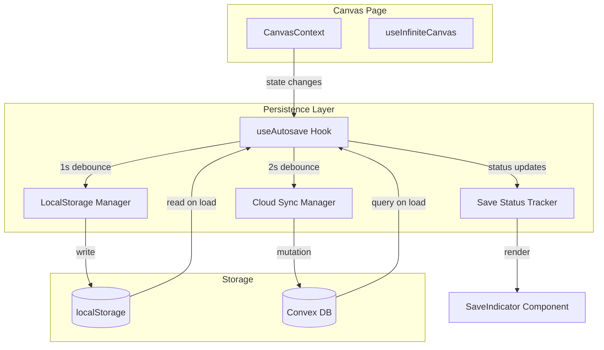

# Design Document: Canvas Autosave

## Overview

The Canvas Autosave system implements a "local-first" persistence architecture that ensures user work is never lost while providing seamless cloud synchronization. The system uses a two-tier approach: immediate localStorage persistence for crash recovery and debounced Convex cloud sync for cross-device access.

The architecture prioritizes:

- **Zero data loss**: Changes are saved locally within 1 second
- **Minimal network overhead**: Cloud syncs are batched with 2-second debounce
- **Graceful degradation**: Works offline with automatic sync recovery
- **Clear user feedback**: Visual save status indicator

## Architecture



## Components and Interfaces

### 1. useAutosave Hook

The main hook that orchestrates all persistence operations.

```typescript
interface UseAutosaveOptions {
  projectId: string;
  localDebounceMs?: number; // Default: 1000
  cloudDebounceMs?: number; // Default: 2000
  maxRetries?: number; // Default: 3
}

interface UseAutosaveReturn {
  saveStatus: SaveStatus;
  lastSavedAt: number | null;
  isLoading: boolean;
  error: AutosaveError | null;
  forceSave: () => Promise<void>;
  clearLocalData: () => void;
}

type SaveStatus = "saved" | "saving" | "offline" | "error";

interface AutosaveError {
  type: "localStorage" | "network" | "auth" | "validation";
  message: string;
  timestamp: number;
}
```

### 2. LocalStorage Manager

Handles immediate local persistence with error handling.

```typescript
interface LocalStorageManager {
  save(projectId: string, data: CanvasProjectData): SaveResult;
  load(projectId: string): CanvasProjectData | null;
  clear(projectId: string): void;
  getLastModified(projectId: string): number | null;
}

interface SaveResult {
  success: boolean;
  error?: string;
}
```

### 3. Cloud Sync Manager

Manages Convex mutations with retry logic.

```typescript
interface CloudSyncManager {
  sync(projectId: string, data: CanvasProjectData): Promise<SyncResult>;
  fetch(projectId: string): Promise<CanvasProjectData | null>;
}

interface SyncResult {
  success: boolean;
  error?: SyncError;
  retryCount: number;
}

interface SyncError {
  type: "network" | "auth" | "validation" | "unknown";
  message: string;
  retryable: boolean;
}
```

### 4. Convex API Extensions

New mutations and queries for canvas persistence.

```typescript
// convex/projects.ts additions

// Save canvas state
saveCanvasState: mutation({
  args: {
    projectId: v.id("projects"),
    canvasData: v.object({
      viewport: v.object({
        scale: v.number(),
        translate: v.object({ x: v.number(), y: v.number() }),
      }),
      shapes: v.any(),
      tool: v.string(),
      selected: v.any(),
      frameCounter: v.number(),
      history: v.optional(v.any()),
      historyPointer: v.optional(v.number()),
      version: v.string(),
      lastModified: v.number(),
    }),
  },
  handler: async (ctx, args) => {
    /* ... */
  },
});

// Get canvas state
getCanvasState: query({
  args: { projectId: v.id("projects") },
  handler: async (ctx, args) => {
    /* ... */
  },
});
```

### 5. SaveIndicator Component

Visual feedback component for save status.

```typescript
interface SaveIndicatorProps {
  status: SaveStatus;
  lastSavedAt: number | null;
}
```

## Data Models

### CanvasProjectData (Extended)

```typescript
interface CanvasProjectData {
  viewport: {
    scale: number;
    translate: { x: number; y: number };
  };
  shapes: EntityState<Shape>;
  tool: Tool;
  selected: SelectionMap;
  frameCounter: number;
  history?: HistoryEntry[];
  historyPointer?: number;
  version: string; // Schema version for migrations
  lastModified: number; // Unix timestamp
  clientId?: string; // For conflict detection (future)
}
```

### Convex Schema Update

```typescript
// Updated projects table fields
sketchesData: v.optional(v.any()),      // Shape entities
viewportData: v.optional(v.object({
  scale: v.number(),
  translate: v.object({ x: v.number(), y: v.number() }),
})),
canvasVersion: v.optional(v.string()),   // Schema version
lastModified: v.number(),                // Already exists
```

## Correctness Properties

_A property is a characteristic or behavior that should hold true across all valid executions of a system-essentially, a formal statement about what the system should do. Properties serve as the bridge between human-readable specifications and machine-verifiable correctness guarantees._

### Property 1: Canvas State Round-Trip Consistency

_For any_ valid canvas state (containing shapes, selection, tool, and frame counter), serializing the state to JSON and then deserializing it SHALL produce an equivalent state with all properties preserved.

**Validates: Requirements 1.4, 7.1, 7.2, 7.5**

### Property 2: Viewport State Round-Trip Consistency

_For any_ valid viewport state (containing scale and translate coordinates), saving to localStorage and loading back SHALL restore the exact same viewport position and zoom level.

**Validates: Requirements 6.1, 6.2, 6.3, 6.4**

### Property 3: Debounce Batching Behavior

_For any_ sequence of N rapid state changes occurring within the debounce window, only the final state SHALL be persisted, and the number of actual write operations SHALL be less than N.

**Validates: Requirements 1.3, 2.2**

### Property 4: Timestamp-Based Conflict Resolution

_For any_ two canvas states with different lastModified timestamps, the conflict resolver SHALL always select the state with the higher (more recent) timestamp.

**Validates: Requirements 4.2**

### Property 5: Save Status Derivation

_For any_ combination of (isDirty, isSyncing, hasError, isOffline) flags, the derived SaveStatus SHALL be deterministic and follow the priority: error > offline > saving > saved.

**Validates: Requirements 3.1, 3.2, 3.3, 3.4**

### Property 6: Serialization Version Inclusion

_For any_ serialized canvas state, the output SHALL contain a valid version string that can be used for schema migration.

**Validates: Requirements 7.3, 7.4**

## Error Handling

### LocalStorage Errors

| Error Type    | Handling Strategy                                                   |
| ------------- | ------------------------------------------------------------------- |
| QuotaExceeded | Attempt to clear old project data, notify user if still failing     |
| SecurityError | Fall back to in-memory only, warn user                              |
| Parse Error   | Log error, initialize fresh state, preserve cloud data if available |

### Convex/Network Errors

| Error Type       | Handling Strategy                                           |
| ---------------- | ----------------------------------------------------------- |
| Network Error    | Retry with exponential backoff (1s, 2s, 4s), max 3 attempts |
| Auth Error       | Set status to 'error', prompt re-authentication             |
| Validation Error | Log details, do not retry (data issue)                      |
| Unknown Error    | Retry once, then mark as offline                            |

### Retry Configuration

```typescript
const RETRY_CONFIG = {
  maxRetries: 3,
  baseDelayMs: 1000,
  maxDelayMs: 8000,
  backoffMultiplier: 2,
};
```

## Testing Strategy

### Dual Testing Approach

This feature requires both unit tests and property-based tests:

- **Unit tests**: Verify specific examples, edge cases, and error conditions
- **Property-based tests**: Verify universal properties that should hold across all inputs

### Property-Based Testing Library

We will use **fast-check** for property-based testing in TypeScript/JavaScript.

```bash
pnpm add -D fast-check
```

### Test Configuration

- Each property-based test SHALL run a minimum of 100 iterations
- Each property-based test SHALL be tagged with a comment referencing the correctness property

### Test Categories

#### Unit Tests

1. **Serialization/Deserialization**

   - Test each shape type serializes correctly
   - Test viewport state serialization
   - Test version field inclusion

2. **Debounce Logic**

   - Test that rapid calls are batched
   - Test that final state is persisted after debounce window

3. **Conflict Resolution**

   - Test local-newer-than-cloud scenario
   - Test cloud-newer-than-local scenario
   - Test equal timestamps scenario

4. **Error Handling**

   - Test localStorage quota exceeded handling
   - Test network error retry logic
   - Test auth error handling

5. **Save Status**
   - Test status transitions
   - Test status derivation from flags

#### Property-Based Tests

1. **Property 1**: Canvas state round-trip

   - Generate arbitrary shapes, serialize, deserialize, compare

2. **Property 2**: Viewport state round-trip

   - Generate arbitrary viewport states, save, load, compare

3. **Property 3**: Debounce batching

   - Generate sequences of state changes, verify batching

4. **Property 4**: Timestamp conflict resolution

   - Generate pairs of states with timestamps, verify newer wins

5. **Property 5**: Save status derivation

   - Generate all flag combinations, verify deterministic status

6. **Property 6**: Version inclusion
   - Generate arbitrary states, verify version in output

### Test File Structure

```
lib/canvas/__tests__/
  persistence.test.ts          # Unit tests for serialization
  persistence.property.test.ts # Property tests for round-trip
hooks/__tests__/
  use-autosave.test.ts         # Unit tests for hook logic
  use-autosave.property.test.ts # Property tests for debounce/status
```

## Implementation Notes

### Debounce Implementation

Use separate debounce timers for local and cloud saves:

```typescript
// Local save: 1 second debounce
const localDebounce = useDebouncedCallback(saveToLocal, 1000);

// Cloud sync: 2 second debounce (after local save)
const cloudDebounce = useDebouncedCallback(syncToCloud, 2000);
```

### State Comparison

For conflict resolution, compare `lastModified` timestamps:

```typescript
function resolveConflict(
  local: CanvasProjectData | null,
  cloud: CanvasProjectData | null
): CanvasProjectData | null {
  if (!local && !cloud) return null;
  if (!local) return cloud;
  if (!cloud) return local;
  return local.lastModified >= cloud.lastModified ? local : cloud;
}
```

### Beforeunload Warning

Warn users about unsaved changes:

```typescript
useEffect(() => {
  const handler = (e: BeforeUnloadEvent) => {
    if (isDirty) {
      e.preventDefault();
      e.returnValue = "";
    }
  };
  window.addEventListener("beforeunload", handler);
  return () => window.removeEventListener("beforeunload", handler);
}, [isDirty]);
```

### Save Indicator Positioning

Position in bottom-right corner, above zoom controls:

```typescript
<div className="absolute bottom-20 right-4 z-50">
  <SaveIndicator status={saveStatus} lastSavedAt={lastSavedAt} />
</div>
```
