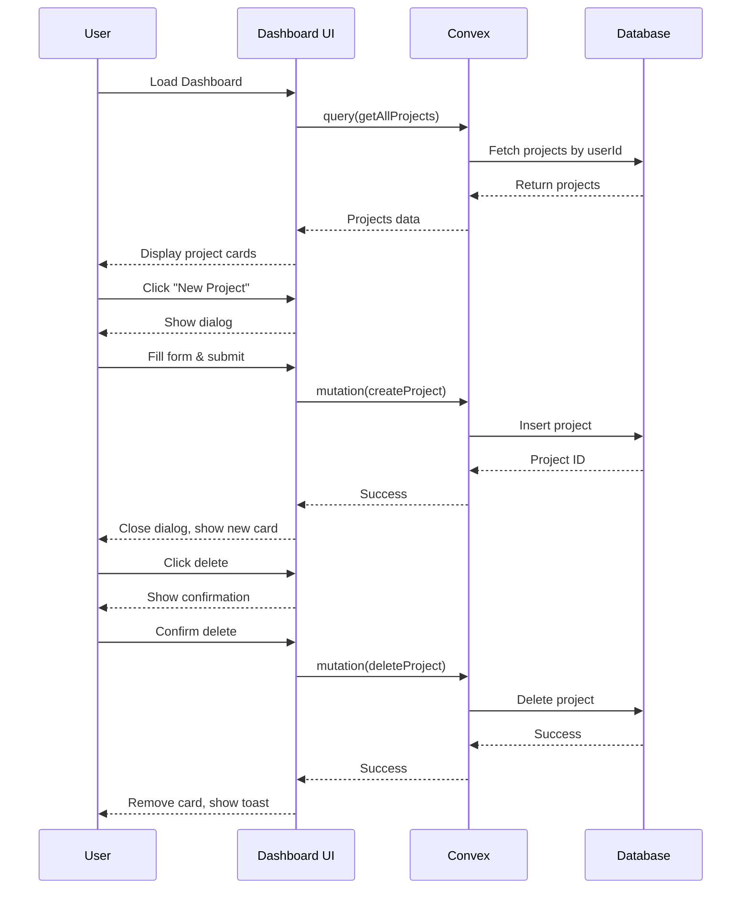
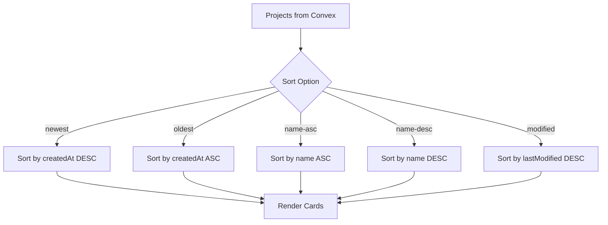

# Design Document

## Overview

The dashboard projects feature provides a full-width, clean interface for authenticated users to manage their design-to-code projects. The design emphasizes visual clarity, responsive layouts, and smooth interactions while maintaining the Unit {set} brand identity. The architecture follows Next.js 15 App Router patterns with Convex for backend operations and Clerk for authentication.

## Architecture

### Component Hierarchy

```
DashboardPage (Server Component)
├── DashboardHeader (Client Component)
│   ├── Logo (Link to home)
│   ├── ProjectFilters (Client Component)
│   └── CreateProjectButton (Client Component)
│       └── CreateProjectDialog (Client Component)
├── ProjectsGrid (Client Component)
│   ├── LoadingSkeletons (when loading)
│   ├── EmptyState (when no projects)
│   └── ProjectCard[] (Client Components)
│       ├── ProjectThumbnail
│       ├── ProjectInfo
│       └── ProjectActions
│           └── DeleteProjectDialog (Client Component)
└── Toaster (for notifications)
```

### Data Flow

1. **Authentication**: Clerk provides user identity via `useUser()` hook
2. **Data Fetching**: Convex `useQuery()` hook fetches projects for authenticated user
3. **Mutations**: Convex `useMutation()` hooks handle create/delete operations
4. **Optimistic Updates**: Use React 19's `useOptimistic` for immediate UI feedback
5. **State Management**: Local React state for filters, dialogs, and UI interactions

### Technology Stack Integration

- **Next.js 15 App Router**: Server/Client component split for optimal performance
- **Convex**: Real-time queries and mutations with automatic revalidation
- **Clerk**: Authentication state and user information
- **shadcn/ui**: Pre-built components (Card, Dialog, Button, Select, etc.)
- **Tailwind CSS v4**: Styling with CSS variables for theming
- **Lucide React**: Icons for UI actions
- **React 19**: useOptimistic for optimistic updates, useTransition for pending states

## Components and Interfaces

### 1. Convex Backend (convex/projects.ts)

#### Schema Extension

The existing schema already includes a `projects` table with all necessary fields:

- `userId`: Clerk user ID for ownership
- `name`: Project name
- `description`: Optional project description
- `thumbnail`: Optional base64 or URL for preview
- `createdAt`: Creation timestamp
- `lastModified`: Last modification timestamp
- `projectNumber`: Auto-incrementing number per user
- Additional fields for future features (tags, isPublic, etc.)

#### Query: getAllProjects

```typescript
export const getAllProjects = query({
  args: {},
  handler: async (ctx) => {
    const identity = await ctx.auth.getUserIdentity();
    if (!identity) {
      throw new Error("Not authenticated");
    }

    const projects = await ctx.db
      .query("projects")
      .withIndex("by_userId", (q) => q.eq("userId", identity.subject))
      .order("desc") // Most recent first by default
      .collect();

    return projects;
  },
});
```

**Returns**: Array of project objects with all fields

#### Mutation: createProject

```typescript
export const createProject = mutation({
  args: {
    name: v.string(),
    description: v.optional(v.string()),
  },
  handler: async (ctx, args) => {
    const identity = await ctx.auth.getUserIdentity();
    if (!identity) {
      throw new Error("Not authenticated");
    }

    // Validate name length
    if (args.name.length < 1 || args.name.length > 100) {
      throw new Error("Project name must be between 1 and 100 characters");
    }

    // Calculate project number based on existing project count
    const existingProjects = await ctx.db
      .query("projects")
      .withIndex("by_userId", (q) => q.eq("userId", identity.subject))
      .collect();

    const projectNumber = existingProjects.length + 1;

    const now = Date.now();
    const projectId = await ctx.db.insert("projects", {
      userId: identity.subject,
      name: args.name,
      description: args.description,
      sketchesData: { shapes: [], selectedIds: [] },
      createdAt: now,
      lastModified: now,
      projectNumber,
    });

    return projectId;
  },
});
```

**Args**: `{ name: string, description?: string }`
**Returns**: Project ID

#### Mutation: deleteProject

```typescript
export const deleteProject = mutation({
  args: {
    projectId: v.id("projects"),
  },
  handler: async (ctx, args) => {
    const identity = await ctx.auth.getUserIdentity();
    if (!identity) {
      throw new Error("Not authenticated");
    }

    // Verify ownership
    const project = await ctx.db.get(args.projectId);
    if (!project) {
      throw new Error("Project not found");
    }
    if (project.userId !== identity.subject) {
      throw new Error("Not authorized to delete this project");
    }

    await ctx.db.delete(args.projectId);
  },
});
```

**Args**: `{ projectId: Id<"projects"> }`
**Returns**: void

### 2. Dashboard Page (app/dashboard/page.tsx)

Server Component that renders the main dashboard layout. Minimal logic, delegates to client components.

```typescript
export default function DashboardPage() {
  return (
    <div className="min-h-screen bg-background">
      <DashboardHeader />
      <main className="container mx-auto px-4 py-8 sm:px-6 lg:px-8">
        <ProjectsGrid />
      </main>
    </div>
  );
}
```

### 3. DashboardHeader Component

Client component for the header section with logo, filters, and create button.

**Props**: None

**State**:

- Filter/sort selection (local state)

**Layout**:

- Full-width header with border-bottom
- Flexbox layout: Logo (left) | Filters (center/right) | Create Button (right)
- Responsive: Stack on mobile, horizontal on desktop
- Height: 64px on desktop, auto on mobile
- Padding: px-4 sm:px-6 lg:px-8

**Elements**:

- Logo: unitset_fulllogo.svg, height 40px, clickable link to "/"
- Filters: Select dropdown for sort options
- Create button: Primary variant, "New Project" text with Plus icon

### 4. ProjectFilters Component

Client component for filtering and sorting controls.

**Props**:

```typescript
interface ProjectFiltersProps {
  sortBy: SortOption;
  onSortChange: (sort: SortOption) => void;
}

type SortOption = "newest" | "oldest" | "name-asc" | "name-desc" | "modified";
```

**UI**:

- Select component from shadcn/ui
- Label: "Sort by"
- Options:
  - "Newest first" (default)
  - "Oldest first"
  - "Name (A-Z)"
  - "Name (Z-A)"
  - "Recently modified"

### 5. CreateProjectDialog Component

Client component for project creation modal.

**Props**:

```typescript
interface CreateProjectDialogProps {
  open: boolean;
  onOpenChange: (open: boolean) => void;
}
```

**State**:

- Form data: name, description
- Pending state from useTransition
- Error state for validation/submission errors

**Form Fields**:

- Name: Input, required, max 100 chars, autofocus
- Description: Textarea, optional, max 500 chars, 3 rows

**Actions**:

- Cancel button (outline variant)
- Create button (primary variant, disabled when pending or invalid)

**Behavior**:

- Validate on submit
- Show inline errors
- Use useTransition for pending state
- Close on success, show toast notification
- Keep open on error, display error message

### 6. ProjectsGrid Component

Client component that fetches and displays projects.

**Props**: None

**Hooks**:

- `useQuery(api.projects.getAllProjects)` - Fetch projects
- `useState` - Local sort/filter state
- `useMemo` - Computed sorted/filtered projects

**Layout**:

- CSS Grid with responsive columns:
  - Mobile: 1 column
  - Tablet (sm): 2 columns
  - Desktop (lg): 3 columns
  - Large (xl): 4 columns
- Gap: gap-6
- Auto-fit with minmax for fluid responsiveness

**States**:

- Loading: Display 6-8 skeleton cards
- Empty: Display empty state with illustration and CTA
- Error: Display error message with retry button
- Success: Display project cards

### 7. ProjectCard Component

Client component for individual project display.

**Props**:

```typescript
interface ProjectCardProps {
  project: {
    _id: Id<"projects">;
    name: string;
    description?: string;
    thumbnail?: string;
    projectNumber: number;
    createdAt: number;
    lastModified: number;
  };
}
```

**Layout**:

- Card component from shadcn/ui
- Hover effect: scale-[1.02] transition
- Cursor: pointer
- Shadow: shadow-sm, hover:shadow-md

**Structure**:

```
Card
├── CardHeader (clickable, navigates to project)
│   ├── Thumbnail (aspect-ratio 16:9, bg-muted if no image)
│   └── ProjectNumber badge (top-right overlay)
├── CardContent
│   ├── CardTitle (project name, truncate)
│   ├── CardDescription (description, 2 lines max, truncate)
│   └── Metadata (created date, last modified)
└── CardFooter
    └── Actions (delete button with dropdown menu)
```

**Thumbnail**:

- Aspect ratio: 16:9
- Background: bg-muted with centered icon if no thumbnail
- Border radius: rounded-lg
- Object fit: cover

**Metadata**:

- Small text, muted color
- Format: "Created 2 days ago • Modified 1 hour ago"
- Use relative time formatting

**Actions**:

- Dropdown menu (three dots icon)
- Options: Delete (destructive color)
- Click stops propagation to prevent navigation

### 8. DeleteProjectDialog Component

Client component for delete confirmation.

**Props**:

```typescript
interface DeleteProjectDialogProps {
  project: {
    _id: Id<"projects">;
    name: string;
  };
  open: boolean;
  onOpenChange: (open: boolean) => void;
}
```

**Content**:

- Title: "Delete Project?"
- Description: "Are you sure you want to delete '{projectName}'? This action cannot be undone."
- Cancel button (outline)
- Delete button (destructive variant, disabled when pending)

**Behavior**:

- Use useMutation for delete operation
- Use useTransition for pending state
- Show toast on success
- Show error in dialog on failure
- Close on success

### 9. LoadingSkeleton Component

Client component for loading state.

**Props**: None

**Layout**:

- Same grid as ProjectsGrid
- 6-8 skeleton cards

**Skeleton Card Structure**:

- Card with Skeleton components
- Thumbnail skeleton (aspect-ratio 16:9)
- Title skeleton (h-6, w-3/4)
- Description skeleton (h-4, w-full, 2 lines)
- Metadata skeleton (h-3, w-1/2)

### 10. EmptyState Component

Client component for no projects state.

**Props**: None

**Content**:

- Centered layout
- Icon: Large folder or project icon (size-16, muted color)
- Heading: "No projects yet"
- Description: "Create your first project to start designing"
- CTA: Primary button "Create Project" (triggers create dialog)

**Layout**:

- Centered vertically and horizontally
- Max width: 400px
- Padding: py-16

## Data Models

### Project Type (TypeScript)

```typescript
import { Doc, Id } from "./_generated/dataModel";

export type Project = Doc<"projects">;

export type ProjectSortOption =
  | "newest"
  | "oldest"
  | "name-asc"
  | "name-desc"
  | "modified";

export interface CreateProjectInput {
  name: string;
  description?: string;
}

export interface ProjectFilters {
  sortBy: ProjectSortOption;
}
```

### Form Validation

```typescript
import { z } from "zod";

export const createProjectSchema = z.object({
  name: z
    .string()
    .min(1, "Name is required")
    .max(100, "Name must be less than 100 characters"),
  description: z
    .string()
    .max(500, "Description must be less than 500 characters")
    .optional(),
});
```

## Error Handling

### Authentication Errors

- **Scenario**: User not authenticated
- **Handling**: Convex queries/mutations throw error, Clerk redirects to sign-in
- **UI**: Show error toast, redirect handled by middleware

### Network Errors

- **Scenario**: Convex request fails
- **Handling**: Display error message in UI
- **UI**: Toast notification with retry option

### Validation Errors

- **Scenario**: Invalid form input
- **Handling**: Client-side validation with zod
- **UI**: Inline error messages in form fields

### Authorization Errors

- **Scenario**: User tries to delete another user's project
- **Handling**: Convex mutation throws error
- **UI**: Toast notification with error message

### Not Found Errors

- **Scenario**: Project doesn't exist
- **Handling**: Convex returns null or throws error
- **UI**: Toast notification, remove from UI optimistically

## Testing Strategy

### Unit Tests

- Convex query/mutation logic (authentication, validation, authorization)
- Form validation schemas
- Utility functions (date formatting, sorting logic)

### Component Tests

- ProjectCard rendering with different props
- CreateProjectDialog form validation
- DeleteProjectDialog confirmation flow
- EmptyState display
- LoadingSkeleton rendering

### Integration Tests

- Full create project flow (open dialog → fill form → submit → see new card)
- Full delete project flow (click delete → confirm → see card removed)
- Filter/sort functionality (change filter → see reordered cards)
- Error handling (network error → see error message → retry)

### E2E Tests

- User can view their projects on dashboard
- User can create a new project
- User can delete a project
- User can filter/sort projects
- Loading states display correctly
- Empty state displays when no projects

## UI/UX Details

### Responsive Breakpoints

- Mobile: < 640px (1 column)
- Tablet: 640px - 1024px (2 columns)
- Desktop: 1024px - 1280px (3 columns)
- Large: > 1280px (4 columns)

### Animations

- Card hover: scale-[1.02] with transition-transform duration-200
- Card delete: fade-out with duration-300
- Dialog: fade-in/zoom-in from Radix UI
- Loading skeleton: pulse animation

### Color Scheme

- Background: bg-background
- Cards: bg-card with border
- Text: text-foreground, text-muted-foreground
- Primary actions: bg-primary, text-primary-foreground
- Destructive actions: bg-destructive, text-destructive-foreground
- Borders: border-border
- Shadows: shadow-sm, shadow-md

### Typography

- Page title: text-2xl font-semibold
- Card title: text-lg font-semibold
- Card description: text-sm text-muted-foreground
- Metadata: text-xs text-muted-foreground
- Button text: text-sm font-medium

### Spacing

- Container padding: px-4 sm:px-6 lg:px-8
- Section spacing: py-8
- Card padding: p-6
- Grid gap: gap-6
- Element gap: gap-2, gap-4

### Accessibility

- Semantic HTML (header, main, nav)
- ARIA labels for icon buttons
- Keyboard navigation support
- Focus visible states
- Screen reader announcements for actions
- Proper heading hierarchy

### Performance Optimizations

- Server Components for static content
- Client Components only where needed
- Memoized sorted/filtered lists
- Optimistic updates for immediate feedback
- Lazy loading for images
- Skeleton screens for perceived performance

## Mermaid Diagrams

### Component Architecture

```mermaid
graph TD
    A[DashboardPage Server] --> B[DashboardHeader Client]
    A --> C[ProjectsGrid Client]

    B --> D[Logo Link]
    B --> E[ProjectFilters Client]
    B --> F[CreateProjectButton]

    F --> G[CreateProjectDialog Client]

    C --> H{Loading?}
    H -->|Yes| I[LoadingSkeleton]
    H -->|No| J{Has Projects?}

    J -->|No| K[EmptyState]
    J -->|Yes| L[ProjectCard[] Client]

    L --> M[ProjectThumbnail]
    L --> N[ProjectInfo]
    L --> O[ProjectActions]

    O --> P[DeleteProjectDialog Client]

    G --> Q[Convex: createProject]
    P --> R[Convex: deleteProject]
    C --> S[Convex: getAllProjects]
```

### Data Flow



### Sort/Filter Logic


