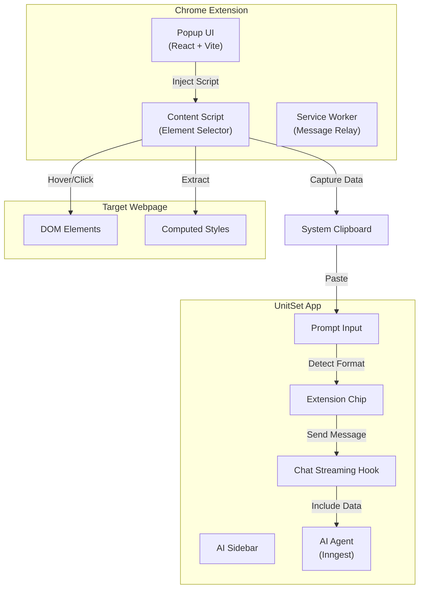

# Design Document: HTML Element Selector Extension

## Overview

This feature extends the UnitSet Chrome extension to provide a visual element selection tool that captures comprehensive HTML and CSS data from any webpage. The captured content integrates seamlessly with the UnitSet AI sidebar, displaying as a professional "Extension Chip" in the input field. The AI agent's system prompt is updated to recognize and replicate captured components.

The system consists of three main parts:

1. **Chrome Extension** - Popup UI, content script for element selection, and capture logic
2. **AI Sidebar Integration** - Detection of extension content, chip display, and message handling
3. **AI System Prompt Update** - Instructions for the AI to recognize and replicate captured components

## Architecture



## Components and Interfaces

### 1. Extension Popup Component

**File:** `unitset-extension/src/App.tsx`

```typescript
interface PopupState {
  isSelecting: boolean;
  error: string | null;
}

// Main popup component with "Select HTML" button
function App(): JSX.Element;
```

### 2. Content Script (Element Selector)

**File:** `unitset-extension/src/content/element-selector.ts`

```typescript
interface SelectionState {
  isActive: boolean;
  currentElement: HTMLElement | null;
  originalOutline: string | null;
}

interface CapturedElement {
  version: string;
  type: "unitset-element-capture";
  timestamp: number;
  data: {
    html: string;
    styles: ComputedStyleMap;
    metadata: ElementMetadata;
  };
}

interface ComputedStyleMap {
  [selector: string]: {
    [property: string]: string;
  };
}

interface ElementMetadata {
  tagName: string;
  dimensions: { width: number; height: number };
  position: { top: number; left: number };
  childCount: number;
  textContent: string | null;
}

// Functions
function activateSelectionMode(): void;
function deactivateSelectionMode(): void;
function highlightElement(element: HTMLElement): void;
function removeHighlight(): void;
function captureElement(element: HTMLElement): CapturedElement;
function extractComputedStyles(element: HTMLElement): ComputedStyleMap;
function copyToClipboard(data: CapturedElement): Promise<void>;
```

### 3. Extension Chip Component

**File:** `components/canvas/ExtensionChip.tsx`

```typescript
interface ExtensionChipProps {
  content: CapturedElement;
  onRemove: () => void;
}

function ExtensionChip({ content, onRemove }: ExtensionChipProps): JSX.Element;
```

### 4. Extension Content Detection Utility

**File:** `lib/extension-content.ts`

```typescript
interface ParsedExtensionContent {
  isExtensionContent: boolean;
  data: CapturedElement | null;
  rawText: string;
}

function parseExtensionContent(text: string): ParsedExtensionContent;
function isExtensionContentFormat(text: string): boolean;
function encodeForClipboard(data: CapturedElement): string;
function decodeFromClipboard(encoded: string): CapturedElement | null;
```

### 5. Updated Chat Input Component

**File:** `components/canvas/AISidebar.tsx` (ChatInput function)

```typescript
interface ChatInputState {
  inputValue: string;
  extensionContent: CapturedElement | null;
}

// Updated to handle extension content detection and chip display
```

## Data Models

### CapturedElement Schema

```typescript
{
  version: "1.0",
  type: "unitset-element-capture",
  timestamp: 1701234567890,
  data: {
    html: "<div class=\"card\">...</div>",
    styles: {
      ".card": {
        "background-color": "rgb(255, 255, 255)",
        "border-radius": "8px",
        "padding": "16px",
        // ... all computed styles
      },
      ".card > h2": {
        "font-size": "24px",
        "font-weight": "600",
        // ...
      }
    },
    metadata: {
      tagName: "DIV",
      dimensions: { width: 320, height: 200 },
      position: { top: 100, left: 50 },
      childCount: 5,
      textContent: "Card Title..."
    }
  }
}
```

### Clipboard Format

The captured content is encoded as a base64 JSON string with a prefix marker:

```
UNITSET_CAPTURE:eyJ2ZXJzaW9uIjoiMS4wIiwidHlwZSI6InVuaXRzZXQtZWxlbWVudC1jYXB0dXJlIi4uLn0=
```

## Correctness Properties

_A property is a characteristic or behavior that should hold true across all valid executions of a system-essentially, a formal statement about what the system should do. Properties serve as the bridge between human-readable specifications and machine-verifiable correctness guarantees._

### Property 1: Single Element Highlight Invariant

_For any_ sequence of mouse hover events over different elements, at most one element should have the highlight style applied at any given time.
**Validates: Requirements 2.1, 2.2**

### Property 2: Cleanup Restores Original State

_For any_ element that had its outline modified during selection mode, after deactivation the element's outline style should equal its original value before selection mode was activated.
**Validates: Requirements 3.2, 3.3**

### Property 3: Capture Includes Complete HTML

_For any_ DOM element, the captured data's `html` field should contain the element's complete outerHTML including all descendant elements.
**Validates: Requirements 4.1, 8.2**

### Property 4: Capture Includes All Computed Styles

_For any_ DOM element with descendants, the captured data's `styles` object should contain entries for the element and every descendant element with non-default styles.
**Validates: Requirements 4.2**

### Property 5: Capture Includes Required Metadata

_For any_ captured element, the metadata object should contain tagName, dimensions (width, height), position (top, left), and childCount fields.
**Validates: Requirements 4.3**

### Property 6: Extension Content Detection Accuracy

_For any_ string, the `isExtensionContentFormat` function should return true if and only if the string starts with "UNITSET_CAPTURE:" and contains valid base64-encoded JSON matching the CapturedElement schema.
**Validates: Requirements 5.1, 7.3**

### Property 7: Serialization Round-Trip

_For any_ valid CapturedElement object, encoding it with `encodeForClipboard` and then decoding with `decodeFromClipboard` should produce an equivalent object.
**Validates: Requirements 7.1, 7.4**

### Property 8: Serialized Content Contains Version

_For any_ serialized CapturedElement, the decoded JSON should contain a `version` field with a non-empty string value.
**Validates: Requirements 7.2**

### Property 9: Message Payload Includes Full Data

_For any_ message sent with extension content attached, the payload sent to the AI should contain the complete CapturedElement data, not just the display text.
**Validates: Requirements 6.1**

## Error Handling

### Extension Errors

| Error Scenario                 | Handling                                        |
| ------------------------------ | ----------------------------------------------- |
| Script injection fails         | Display error in popup, suggest refreshing page |
| Element capture fails          | Show toast notification, exit selection mode    |
| Clipboard write fails          | Show error message with manual copy fallback    |
| Invalid page (chrome://, etc.) | Disable button, show explanatory message        |

### AI Sidebar Errors

| Error Scenario            | Handling                               |
| ------------------------- | -------------------------------------- |
| Invalid clipboard content | Treat as regular text, no chip display |
| Malformed JSON in content | Log warning, treat as regular text     |
| Missing required fields   | Partial display with warning indicator |

## Testing Strategy

### Property-Based Testing

The project will use **fast-check** for property-based testing in TypeScript. Each correctness property will be implemented as a property-based test with a minimum of 100 iterations.

Property-based tests will be tagged with comments in the format:
`**Feature: html-element-selector-extension, Property {number}: {property_text}**`

### Unit Tests

Unit tests will cover:

- Extension popup button rendering and click handling
- Content script highlight/unhighlight functions
- Style extraction for various CSS properties
- Metadata extraction accuracy
- Extension content format detection
- Encoding/decoding functions
- Extension chip component rendering
- Chat input paste handling

### Integration Tests

- End-to-end flow from popup click to clipboard content
- Paste detection and chip display in AI sidebar
- Message sending with extension content

### Test Files Structure

```
unitset-extension/src/__tests__/
  element-selector.test.ts      # Content script logic tests
  capture.test.ts               # Capture and serialization tests
  capture.property.test.ts      # Property-based tests for capture

lib/__tests__/
  extension-content.test.ts     # Detection and parsing tests
  extension-content.property.test.ts  # Property-based tests

components/canvas/__tests__/
  ExtensionChip.test.tsx        # Component tests
```

## AI System Prompt Update

The AI agent's system prompt in `inngest/functions.ts` will be updated to include instructions for handling captured element content:

```
## Captured Element Replication

When a user sends a message containing captured element data (marked with "UNITSET_CAPTURE:"), you are receiving HTML and CSS from a component they want to replicate.

### Recognition
- The captured data includes: HTML structure, computed CSS styles, and element metadata
- The styles are the actual computed values from the original page

### Replication Guidelines
1. Analyze the HTML structure and recreate it using semantic React components
2. Convert the CSS styles to Tailwind CSS classes where possible
3. Use shadcn/ui components when the captured element matches common patterns (buttons, cards, inputs, etc.)
4. Preserve the visual appearance as closely as possible
5. Adapt colors to use the project's theme system (bg-background, text-foreground, etc.) unless specific colors are essential to the design
6. Make the component responsive and accessible

### Output
Create a fully functional React component that visually matches the captured element while following the project's coding standards.
```

## Implementation Notes

### Chrome Extension Manifest Updates

The `manifest.json` needs additional permissions:

```json
{
  "permissions": ["scripting", "activeTab", "clipboardWrite"],
  "host_permissions": ["<all_urls>"]
}
```

### Content Script Injection

The content script is injected dynamically when the user clicks "Select HTML" rather than being declared in the manifest. This allows for on-demand activation.

### Style Extraction Strategy

To capture meaningful styles without excessive data:

1. Get computed styles for the target element and all descendants
2. Filter out default/inherited values by comparing against a baseline element
3. Group styles by CSS selector for readability
4. Include only properties that differ from browser defaults

### Highlight Implementation

Use `outline` instead of `border` to avoid layout shifts:

```css
outline: 2px solid #f97316;
outline-offset: 2px;
```

### Extension Chip Design

The chip will use the project's design system:

- Background: `bg-primary/10`
- Border: `border border-primary/30`
- Icon: Lucide `ExternalLink` or custom extension icon
- Close button: `X` icon with hover state

### Extension Popup Design System

The popup should be stunning, professional, and clean - matching UnitSet's design language:

**Color Palette (Dark Theme - Default):**

- Background: `#0a0a0a` (near black)
- Card/Surface: `#171717` (dark gray)
- Primary: `#f97316` (orange - UnitSet brand color)
- Primary Hover: `#ea580c` (darker orange)
- Text Primary: `#fafafa` (white)
- Text Muted: `#a1a1aa` (gray)
- Border: `#27272a` (subtle dark border)
- Success: `#22c55e` (green for confirmation)
- Error: `#ef4444` (red for errors)

**Typography:**

- Font Family: `Inter, system-ui, sans-serif`
- Heading: 16px, font-weight 600
- Body: 14px, font-weight 400
- Small/Caption: 12px, font-weight 400

**Spacing:**

- Popup padding: 20px
- Button padding: 12px 24px
- Element spacing: 16px

**Components:**

- Buttons: Rounded corners (8px), subtle shadow, smooth hover transitions (150ms)
- Primary button: Orange background with white text, glow effect on hover
- Cards: 12px border-radius, subtle border
- Icons: Lucide React icons, 20px size

**Popup Dimensions:**

- Width: 320px
- Min-height: auto (content-based)

**Visual Effects:**

- Subtle gradient on primary button hover
- Smooth transitions (150ms ease-out)
- Hover states with brightness/opacity shifts
- Focus rings using primary color with 30% opacity
- Subtle box-shadow on cards: `0 4px 12px rgba(0,0,0,0.3)`

**States:**

- Default: "Select HTML" button prominent with UnitSet logo
- Selecting: Show "Selection Active" indicator with pulsing orange dot
- Success: Brief green checkmark with "Copied!" message
- Error: Red text with error icon and retry option

**Layout:**

- UnitSet logo at top (centered or left-aligned)
- Clear heading: "Element Selector"
- Subtext explaining the feature
- Prominent CTA button
- Status/feedback area at bottom
