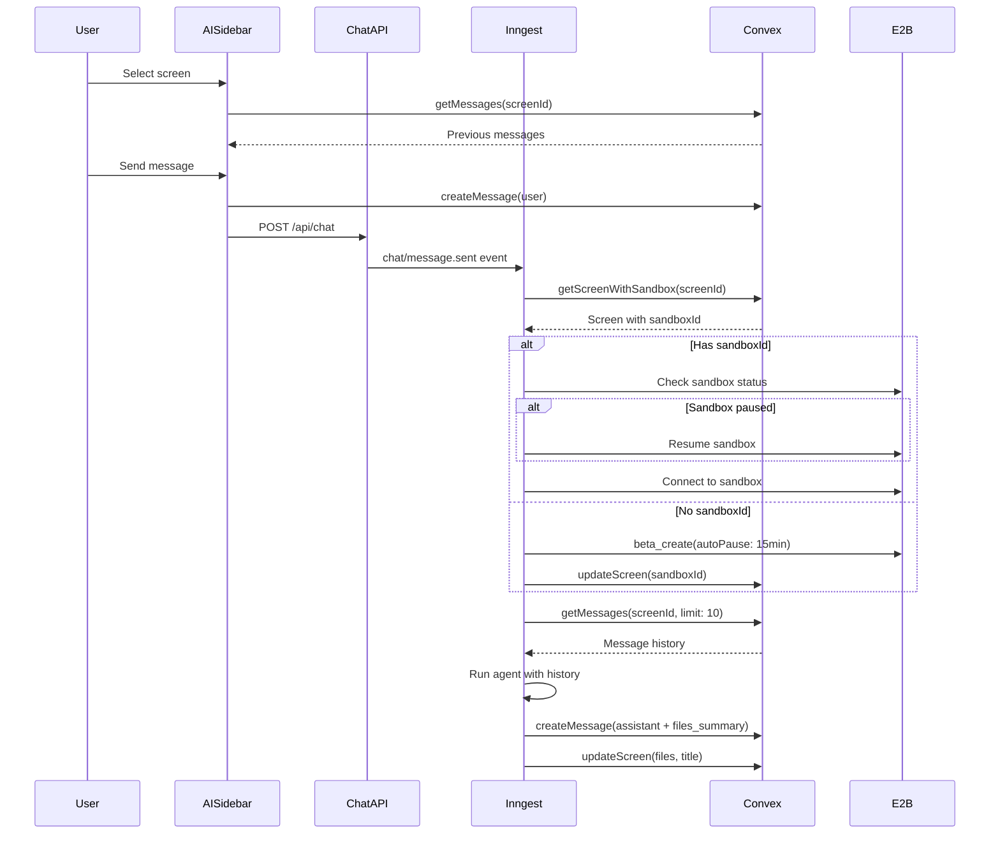

# Design Document

## Overview

This feature implements persistent AI chat history for screen shapes and sandbox lifecycle management. The system will store sandbox IDs with screen records, load previous messages when a screen is selected, pass message history to the AI agent for context, and manage sandbox auto-pause/resume using E2B's beta features.

## Architecture



## Components and Interfaces

### 1. Schema Updates (convex/schema.ts)

Add `sandboxId` field to screens table:

```typescript
screens: defineTable({
  shapeId: v.string(),
  projectId: v.id("projects"),
  title: v.optional(v.string()),
  sandboxUrl: v.optional(v.string()),
  sandboxId: v.optional(v.string()), // NEW: E2B sandbox ID for persistence
  files: v.optional(v.any()),
  createdAt: v.number(),
  updatedAt: v.number(),
});
```

### 2. Screen Queries/Mutations (convex/screens.ts)

New internal query for Inngest:

```typescript
export const internalGetScreen = internalQuery({
  args: { screenId: v.id("screens") },
  handler: async (ctx, args) => {
    return await ctx.db.get(args.screenId);
  },
});
```

Update `internalUpdateScreen` to accept `sandboxId`:

```typescript
export const internalUpdateScreen = internalMutation({
  args: {
    screenId: v.id("screens"),
    sandboxUrl: v.optional(v.string()),
    sandboxId: v.optional(v.string()), // NEW
    files: v.optional(v.any()),
    title: v.optional(v.string()),
  },
  // ...
});
```

### 3. Message Queries (convex/messages.ts)

New internal query for Inngest:

```typescript
export const internalGetMessages = internalQuery({
  args: {
    screenId: v.id("screens"),
    limit: v.optional(v.number()),
  },
  handler: async (ctx, args) => {
    const messages = await ctx.db
      .query("messages")
      .withIndex("by_screenId", (q) => q.eq("screenId", args.screenId))
      .order("desc")
      .take(args.limit || 10);

    return messages.reverse(); // Return in chronological order
  },
});
```

### 4. HTTP Routes (convex/http.ts)

New endpoints for Inngest:

```typescript
// GET /inngest/getScreen - Fetch screen with sandboxId
http.route({
  path: "/inngest/getScreen",
  method: "POST",
  handler: httpAction(async (ctx, request) => {
    const { screenId } = await request.json();
    const screen = await ctx.runQuery(internal.screens.internalGetScreen, {
      screenId,
    });
    return new Response(JSON.stringify(screen), { status: 200 });
  }),
});

// GET /inngest/getMessages - Fetch message history
http.route({
  path: "/inngest/getMessages",
  method: "POST",
  handler: httpAction(async (ctx, request) => {
    const { screenId, limit } = await request.json();
    const messages = await ctx.runQuery(internal.messages.internalGetMessages, {
      screenId,
      limit,
    });
    return new Response(JSON.stringify(messages), { status: 200 });
  }),
});
```

### 5. Inngest Functions (inngest/functions.ts)

Updated `runChatAgent` function:

```typescript
export const runChatAgent = inngest.createFunction(
  { id: "run-chat-agent" },
  { event: "chat/message.sent" },
  async ({ event, step }) => {
    const { message, screenId, projectId } = event.data;

    // Step 1: Get screen to check for existing sandbox
    const screen = await step.run("get-screen", async () => {
      const response = await fetch(`${getConvexHttpUrl()}/inngest/getScreen`, {
        method: "POST",
        headers: { "Content-Type": "application/json" },
        body: JSON.stringify({ screenId }),
      });
      return response.json();
    });

    // Step 2: Get or create sandbox
    const sandboxId = await step.run("get-or-create-sandbox", async () => {
      if (screen?.sandboxId) {
        // Check if sandbox is paused and resume if needed
        const sandbox = await Sandbox.connect(screen.sandboxId);
        // Sandbox.connect handles resume automatically
        return screen.sandboxId;
      }

      // Create new sandbox with auto-pause
      const sandbox = await Sandbox.betaCreate("unitset-sandbox-v1", {
        autoPause: { idleTimeoutMs: 15 * 60 * 1000 }, // 15 minutes
      });

      // Store sandboxId in screen record
      await fetch(`${getConvexHttpUrl()}/inngest/updateScreen`, {
        method: "POST",
        headers: { "Content-Type": "application/json" },
        body: JSON.stringify({ screenId, sandboxId: sandbox.sandboxId }),
      });

      return sandbox.sandboxId;
    });

    // Step 3: Get previous messages for context
    const previousMessages = await step.run(
      "get-previous-messages",
      async () => {
        const response = await fetch(
          `${getConvexHttpUrl()}/inngest/getMessages`,
          {
            method: "POST",
            headers: { "Content-Type": "application/json" },
            body: JSON.stringify({ screenId, limit: 10 }),
          }
        );
        const messages = await response.json();
        return formatMessagesForAgent(messages);
      }
    );

    // Step 4: Run agent with history
    // ... agent execution with previousMessages in state
  }
);
```

### 6. Files Summary Format

The agent will generate a files summary after completing tasks:

```typescript
interface FilesSummary {
  files: Array<{
    path: string;
    description: string;
  }>;
}

// Format in assistant message:
// <files_summary>
// - app/page.tsx: Main landing page with hero section
// - components/Hero.tsx: Hero component with CTA button
// </files_summary>
```

### 7. AISidebar Updates (components/canvas/AISidebar.tsx)

Load messages when screen is selected:

```typescript
// Use Convex query to fetch messages
const messages = useQuery(
  api.messages.getMessages,
  selectedScreenId ? { screenId: selectedScreenId as Id<"screens"> } : "skip"
);

// Convert to local message format
useEffect(() => {
  if (messages) {
    setLocalMessages(
      messages.map((m) => ({
        id: m._id,
        role: m.role,
        content: m.content,
        timestamp: new Date(m.createdAt),
      }))
    );
  }
}, [messages]);
```

## Data Models

### Screen Record (Updated)

```typescript
interface Screen {
  _id: Id<"screens">;
  shapeId: string;
  projectId: Id<"projects">;
  title?: string;
  sandboxUrl?: string;
  sandboxId?: string; // NEW: E2B sandbox ID
  files?: Record<string, string>;
  createdAt: number;
  updatedAt: number;
}
```

### Message Record (Unchanged)

```typescript
interface Message {
  _id: Id<"messages">;
  screenId: Id<"screens">;
  role: "user" | "assistant";
  content: string; // May contain <files_summary> tags
  createdAt: number;
}
```

### Agent Message Format

```typescript
interface AgentMessage {
  role: "user" | "assistant";
  content: string;
}
```

## Correctness Properties

_A property is a characteristic or behavior that should hold true across all valid executions of a system-essentially, a formal statement about what the system should do. Properties serve as the bridge between human-readable specifications and machine-verifiable correctness guarantees._

### Property 1: Message ordering preservation

_For any_ screen with messages, when messages are fetched, they SHALL be returned in ascending chronological order by createdAt timestamp.

**Validates: Requirements 1.1**

### Property 2: Sandbox reuse decision

_For any_ screen record, if sandboxId exists and is non-empty, the system SHALL connect to the existing sandbox; if sandboxId is null or undefined, the system SHALL create a new sandbox.

**Validates: Requirements 2.1, 2.4**

### Property 3: Message history formatting

_For any_ list of message records, the formatting function SHALL produce an array of AgentMessage objects with matching role and content fields in the same order.

**Validates: Requirements 2.2**

### Property 4: Files summary generation

_For any_ non-empty files object, the generateFilesSummary function SHALL produce a string containing all file paths wrapped in files_summary tags.

**Validates: Requirements 2.3, 6.1, 6.4**

### Property 5: Sandbox ID persistence

_For any_ newly created sandbox, after the updateScreen mutation completes, querying the screen SHALL return the stored sandboxId.

**Validates: Requirements 5.1, 5.4**

### Property 6: Files summary inclusion in context

_For any_ message containing files_summary tags, when building agent context, the files_summary content SHALL be preserved in the formatted message.

**Validates: Requirements 6.2, 6.3**

## Error Handling

### Sandbox Connection Failures

1. If `Sandbox.connect()` fails (sandbox expired/deleted):

   - Create a new sandbox using `Sandbox.betaCreate()`
   - Update screen record with new sandboxId
   - Add system message noting context was lost

2. If `Sandbox.betaCreate()` fails:
   - Return error to user
   - Do not create assistant message
   - Allow retry

### Message Fetch Failures

1. If message history fetch fails:
   - Continue with empty history
   - Log warning
   - Agent operates without context

### Convex Update Failures

1. If screen update fails:
   - Log error
   - Continue with agent execution
   - Sandbox may be orphaned (acceptable for beta)

## Testing Strategy

### Property-Based Testing

Use `fast-check` for property-based testing in TypeScript.

**Test Configuration:**

- Minimum 100 iterations per property test
- Each test tagged with property reference

**Properties to Test:**

1. **Message ordering** - Generate random messages with timestamps, verify sort order
2. **Sandbox decision logic** - Generate screens with/without sandboxId, verify correct path
3. **Message formatting** - Generate message arrays, verify transformation
4. **Files summary generation** - Generate file objects, verify output format
5. **Files summary parsing** - Generate summaries, verify round-trip

### Unit Tests

1. **formatMessagesForAgent** - Test with empty array, single message, multiple messages
2. **generateFilesSummary** - Test with empty files, single file, multiple files
3. **shouldCreateNewSandbox** - Test decision logic with various screen states
4. **parseFilesSummary** - Test extraction from message content

### Integration Tests

1. **Full chat flow** - Send message, verify sandbox created, message stored
2. **Follow-up message** - Send second message, verify sandbox reused
3. **Screen switch** - Change screens, verify correct messages loaded
