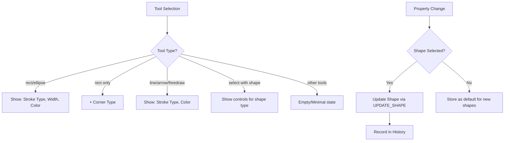

# Design Document: Shape Properties Bar

## Overview

The Shape Properties Bar is a dynamic, contextual toolbar that provides quick access to shape property controls on the canvas. It appears as a horizontal floating bar positioned beside a compact back button in the top-left corner of the canvas. The bar intelligently displays relevant controls based on the currently selected tool or shape, enabling users to modify stroke type, stroke width, color, and corner radius without leaving the canvas workflow.

## Architecture

The feature follows the existing canvas architecture patterns:

```
┌─────────────────────────────────────────────────────────────────┐
│                        Canvas Page                               │
├─────────────────────────────────────────────────────────────────┤
│  ┌──────────────────────────────────────────────────────────┐   │
│  │  Top-Left UI Container                                    │   │
│  │  ┌─────┐ ┌──────────────────────────────────────────┐    │   │
│  │  │ ← │ │  Shape Properties Bar                     │    │   │
│  │  └─────┘ │  [Stroke Type] [Width] [Color] [Corners]│    │   │
│  │          └──────────────────────────────────────────┘    │   │
│  └──────────────────────────────────────────────────────────┘   │
│                                                                  │
│                        Canvas Content                            │
│                                                                  │
└─────────────────────────────────────────────────────────────────┘
```

### State Flow



## Components and Interfaces

### 1. BackButton Component (Modified)

**File:** `components/canvas/BackButton.tsx`

Updates to existing component:

- Remove text label, keep only arrow icon
- Add Tooltip wrapper with "Back to Dashboard" text
- Reduce padding for compact appearance

```typescript
interface BackButtonProps {
  // No props needed - self-contained
}
```

### 2. ShapePropertiesBar Component (New)

**File:** `components/canvas/ShapePropertiesBar.tsx`

Main container component that orchestrates property controls.

```typescript
interface ShapePropertiesBarProps {
  currentTool: Tool;
  selectedShapes: Shape[];
  defaultProperties: ShapeDefaultProperties;
  onPropertyChange: (property: string, value: unknown) => void;
  onDefaultChange: (property: string, value: unknown) => void;
}

interface ShapeDefaultProperties {
  strokeType: "solid" | "dashed";
  strokeWidth: "thin" | "normal" | "thick";
  strokeColor: string;
  cornerType: "sharp" | "rounded";
}
```

### 3. Property Control Components (New)

**File:** `components/canvas/property-controls/`

#### StrokeTypeControl

```typescript
interface StrokeTypeControlProps {
  value: "solid" | "dashed";
  onChange: (value: "solid" | "dashed") => void;
}
```

#### StrokeWidthControl

```typescript
interface StrokeWidthControlProps {
  value: "thin" | "normal" | "thick";
  onChange: (value: "thin" | "normal" | "thick") => void;
}
```

#### ColorPicker

```typescript
interface ColorPickerProps {
  value: string;
  onChange: (value: string) => void;
  colors: string[];
}
```

#### CornerTypeControl

```typescript
interface CornerTypeControlProps {
  value: "sharp" | "rounded";
  onChange: (value: "sharp" | "rounded") => void;
}
```

### 4. Shape Type Extensions

**File:** `types/canvas.ts`

Add new properties to shape types:

```typescript
interface RectShape extends BaseShape {
  // ... existing properties
  strokeType?: "solid" | "dashed";
  borderRadius?: number;
}

interface EllipseShape extends BaseShape {
  // ... existing properties
  strokeType?: "solid" | "dashed";
}

interface LineShape extends BaseShape {
  // ... existing properties
  strokeType?: "solid" | "dashed";
}

interface ArrowShape extends BaseShape {
  // ... existing properties
  strokeType?: "solid" | "dashed";
}

interface FreeDrawShape extends BaseShape {
  // ... existing properties
  strokeType?: "solid" | "dashed";
}
```

### 5. Utility Functions

**File:** `lib/canvas/properties-utils.ts`

```typescript
// Stroke width preset mappings
export const STROKE_WIDTH_MAP = {
  thin: 1,
  normal: 2,
  thick: 4,
} as const;

// Corner radius mappings
export const CORNER_RADIUS_MAP = {
  sharp: 0,
  rounded: 8,
} as const;

// Curated color palette for dark mode
export const COLOR_PALETTE = [
  "#ffffff", // White
  "#a1a1aa", // Zinc 400
  "#f87171", // Red 400
  "#fb923c", // Orange 400
  "#facc15", // Yellow 400
  "#4ade80", // Green 400
  "#22d3ee", // Cyan 400
  "#60a5fa", // Blue 400
  "#a78bfa", // Violet 400
  "#f472b6", // Pink 400
] as const;

// Get controls to display for a tool
export function getControlsForTool(tool: Tool): ControlType[];

// Get controls to display for selected shapes
export function getControlsForShapes(shapes: Shape[]): ControlType[];

// Convert stroke width preset to pixels
export function strokeWidthToPixels(preset: StrokeWidthPreset): number;

// Convert pixels to stroke width preset (for UI display)
export function pixelsToStrokeWidth(pixels: number): StrokeWidthPreset;

// Convert corner type to border radius
export function cornerTypeToRadius(type: CornerType): number;

// Convert border radius to corner type (for UI display)
export function radiusToCornerType(radius: number): CornerType;
```

## Data Models

### ShapeDefaultProperties

Stored in React state (or context) to persist default property values for new shapes:

```typescript
interface ShapeDefaultProperties {
  strokeType: "solid" | "dashed";
  strokeWidth: "thin" | "normal" | "thick";
  strokeColor: string;
  cornerType: "sharp" | "rounded";
}

const DEFAULT_SHAPE_PROPERTIES: ShapeDefaultProperties = {
  strokeType: "solid",
  strokeWidth: "normal",
  strokeColor: "#ffffff",
  cornerType: "rounded",
};
```

### Control Visibility Matrix

| Tool/Shape             | Stroke Type                | Stroke Width | Color | Corner Type |
| ---------------------- | -------------------------- | ------------ | ----- | ----------- |
| rect                   | ✓                          | ✓            | ✓     | ✓           |
| ellipse                | ✓                          | ✓            | ✓     | ✗           |
| line                   | ✓                          | ✗            | ✓     | ✗           |
| arrow                  | ✓                          | ✗            | ✓     | ✗           |
| freedraw               | ✓                          | ✗            | ✓     | ✗           |
| select                 | Based on selected shape(s) |              |
| hand/frame/text/eraser | ✗                          | ✗            | ✗     | ✗           |

## Correctness Properties

_A property is a characteristic or behavior that should hold true across all valid executions of a system-essentially, a formal statement about what the system should do. Properties serve as the bridge between human-readable specifications and machine-verifiable correctness guarantees._

### Property 1: Tool-based control visibility

_For any_ tool selection, the properties bar SHALL display exactly the set of controls defined in the control visibility matrix for that tool type.

**Validates: Requirements 2.2, 2.3, 3.1, 4.1, 5.1, 6.1, 6.5, 7.1**

### Property 2: Stroke type application consistency

_For any_ stroke type selection (solid or dashed), when a new shape is created, that shape SHALL have the corresponding stroke style applied.

**Validates: Requirements 3.2, 3.3, 7.2**

### Property 3: Stroke width preset mapping

_For any_ stroke width preset selection, when a new rectangle or ellipse shape is created, that shape SHALL have the corresponding pixel width: thin→1px, normal→2px, thick→4px.

**Validates: Requirements 4.2, 4.3, 4.4**

### Property 4: Color application consistency

_For any_ color selection from the palette, when a new shape is created, that shape SHALL have that color as its stroke color.

**Validates: Requirements 5.2, 7.3**

### Property 5: Corner type mapping for rectangles

_For any_ corner type selection (sharp or rounded), when a new rectangle shape is created, that shape SHALL have the corresponding border radius: sharp→0px, rounded→8px.

**Validates: Requirements 6.2, 6.3**

### Property 6: Selected shape property reflection

_For any_ selected shape, the properties bar controls SHALL reflect that shape's current property values (stroke type, stroke width, color, corner type as applicable).

**Validates: Requirements 3.4, 4.5, 5.3, 6.4, 7.4**

### Property 7: Real-time shape updates

_For any_ property change while a shape is selected, the selected shape SHALL be updated immediately with the new property value.

**Validates: Requirements 8.1**

### Property 8: Multi-shape batch updates

_For any_ property change while multiple shapes are selected, all selected shapes that support that property SHALL be updated with the new value.

**Validates: Requirements 8.2**

### Property 9: History integration

_For any_ property change applied to a shape, the change SHALL be recorded in the undo/redo history, and undoing SHALL restore the previous property value.

**Validates: Requirements 8.3**

## Error Handling

### Invalid Property Values

- If a shape has an unrecognized stroke width value, default to displaying "normal" in the UI
- If a shape has an unrecognized border radius, default to displaying "rounded" if > 0, "sharp" if 0
- If a shape has an unrecognized stroke type, default to "solid"

### Mixed Selection States

When multiple shapes are selected with different property values:

- Display a "mixed" indicator (e.g., dash or empty state) for that control
- Changing the value applies to all selected shapes

### Unsupported Shape Types

- Frame, text, and generatedui shapes do not support property controls
- When only unsupported shapes are selected, show empty/minimal properties bar

## Testing Strategy

### Dual Testing Approach

This feature requires both unit tests and property-based tests:

1. **Unit Tests**: Verify specific examples, edge cases, and component rendering
2. **Property-Based Tests**: Verify universal properties hold across all inputs

### Property-Based Testing Library

Use **fast-check** for property-based testing in TypeScript/JavaScript.

### Test Configuration

- Minimum 100 iterations per property test
- Each property test tagged with: `**Feature: shape-properties-bar, Property {number}: {property_text}**`

### Unit Test Coverage

1. **BackButton Component**

   - Renders compact arrow icon
   - Shows tooltip on hover
   - Navigates to dashboard on click

2. **ShapePropertiesBar Component**

   - Renders correct controls for each tool type
   - Handles empty/minimal state for non-applicable tools
   - Updates when tool changes

3. **Property Control Components**

   - StrokeTypeControl toggles between solid/dashed
   - StrokeWidthControl cycles through thin/normal/thick
   - ColorPicker displays palette and handles selection
   - CornerTypeControl toggles between sharp/rounded

4. **Utility Functions**
   - strokeWidthToPixels returns correct values
   - pixelsToStrokeWidth handles edge cases
   - cornerTypeToRadius returns correct values
   - radiusToCornerType handles edge cases
   - getControlsForTool returns correct control set

### Property-Based Test Coverage

1. **Property 1**: Generate random tools, verify control visibility matches matrix
2. **Property 2**: Generate random stroke types, create shapes, verify stroke style
3. **Property 3**: Generate random stroke width presets, create shapes, verify pixel width
4. **Property 4**: Generate random colors from palette, create shapes, verify stroke color
5. **Property 5**: Generate random corner types, create rectangles, verify border radius
6. **Property 6**: Generate random shapes with properties, select them, verify UI reflection
7. **Property 7**: Generate random property changes on selected shapes, verify immediate update
8. **Property 8**: Generate random multi-selections, change properties, verify batch update
9. **Property 9**: Generate random property changes, verify history contains change, verify undo restores

### Integration Tests

1. Full workflow: Select tool → Set properties → Draw shape → Verify shape has properties
2. Edit workflow: Select shape → Change property → Verify shape updated → Undo → Verify restored
3. Multi-select workflow: Select multiple shapes → Change property → Verify all updated
