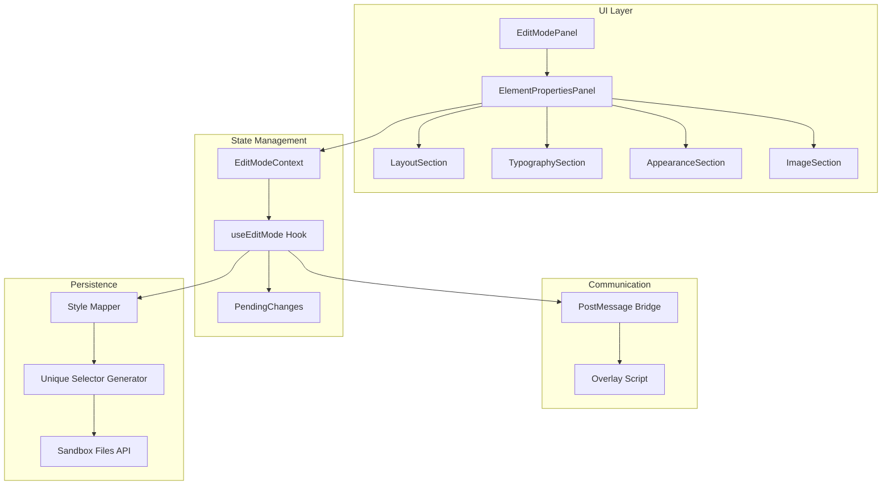

# Design Document

## Overview

The Visual Element Editor v2 is an enhanced properties panel within the Edit tab of the AISidebar. It provides a comprehensive, Figma-like interface for editing DOM elements in the sandbox preview. The design focuses on three key areas:

1. **Element-Type-Aware UI**: Different property sections based on whether the selected element is a container (div), text element (h1-h6, p, span), or image
2. **Comprehensive Property Controls**: Professional Layout, Typography, and Appearance sections with all controls shown in the reference images
3. **Robust Persistence**: Fixing bugs where edits don't persist or affect unintended elements

## Architecture



## Components and Interfaces

### 1. ElementPropertiesPanel (Enhanced)

The main container component that determines which sections to display based on element type.

```typescript
interface ElementPropertiesPanelProps {
  element: SelectedElementInfo;
  pendingChanges: StyleChanges | null;
  onStyleChange: (property: string, value: string) => void;
  onSave: () => void;
  onDiscard: () => void;
  isSaving: boolean;
  hasUnsavedChanges: boolean;
}

// Element type categories
type ElementCategory = "container" | "text" | "image" | "other";

function getElementCategory(tagName: string): ElementCategory {
  const textElements = [
    "h1",
    "h2",
    "h3",
    "h4",
    "h5",
    "h6",
    "p",
    "span",
    "label",
    "a",
  ];
  const containerElements = [
    "div",
    "section",
    "article",
    "main",
    "header",
    "footer",
    "nav",
    "aside",
  ];

  if (tagName === "img") return "image";
  if (textElements.includes(tagName)) return "text";
  if (containerElements.includes(tagName)) return "container";
  return "other";
}
```

### 2. LayoutSection Component

Handles dimensions, display mode, flex properties, and spacing.

```typescript
interface LayoutSectionProps {
  computedStyles: ComputedStylesInfo;
  pendingChanges: StyleChanges | null;
  onStyleChange: (property: string, value: string) => void;
}

type LayoutMode = "flex" | "none";
type DimensionUnit = "px" | "%" | "auto";
type FlexDirection = "row" | "column";
type FlexAlignment = "start" | "center" | "end" | "stretch" | "baseline";
type FlexJustify = "start" | "center" | "end" | "between" | "around" | "evenly";
```

### 3. TypographySection Component

Handles all text-related properties.

```typescript
interface TypographySectionProps {
  computedStyles: ComputedStylesInfo;
  pendingChanges: StyleChanges | null;
  onStyleChange: (property: string, value: string) => void;
  textContent?: string;
}

type TextAlign = "left" | "center" | "right";
type FontWeight =
  | "100"
  | "200"
  | "300"
  | "400"
  | "500"
  | "600"
  | "700"
  | "800"
  | "900";
```

### 4. AppearanceSection Component

Handles background, border, outline, radius, and shadows.

```typescript
interface AppearanceSectionProps {
  computedStyles: ComputedStylesInfo;
  pendingChanges: StyleChanges | null;
  onStyleChange: (property: string, value: string) => void;
}

type BackgroundType = "solid" | "gradient" | "image";
type BorderStyle = "solid" | "dashed" | "dotted" | "none";
type BorderSide = "all" | "top" | "right" | "bottom" | "left";

interface ShadowConfig {
  x: number;
  y: number;
  blur: number;
  spread: number;
  color: string;
  opacity: number;
  visible: boolean;
}
```

### 5. ImageSection Component

Handles image-specific properties.

```typescript
interface ImageSectionProps {
  currentSrc: string;
  onSrcChange: (src: string) => void;
}
```

### 6. UniqueSelector Generator (New)

Generates unique CSS selectors to target specific elements, fixing the bug where edits affect multiple elements.

```typescript
interface UniqueSelector {
  selector: string;
  confidence: "high" | "medium" | "low";
  method: "id" | "data-attr" | "nth-child" | "path";
}

function generateUniqueSelector(element: SelectedElementInfo): UniqueSelector;
function validateSelectorUniqueness(
  selector: string,
  document: Document
): boolean;
```

## Data Models

### Extended ComputedStylesInfo

```typescript
interface ComputedStylesInfo {
  // Typography
  fontFamily: string;
  fontSize: string;
  fontWeight: string;
  fontStyle: string;
  lineHeight: string;
  letterSpacing: string;
  textAlign: string;
  textDecoration: string;
  textTransform: string;
  color: string;

  // Layout
  display: string;
  width: string;
  height: string;
  padding: string;
  paddingTop: string;
  paddingRight: string;
  paddingBottom: string;
  paddingLeft: string;
  margin: string;
  marginTop: string;
  marginRight: string;
  marginBottom: string;
  marginLeft: string;
  gap: string;
  flexDirection: string;
  flexWrap: string;
  justifyContent: string;
  alignItems: string;

  // Appearance
  backgroundColor: string;
  backgroundImage: string;
  borderRadius: string;
  borderTopLeftRadius: string;
  borderTopRightRadius: string;
  borderBottomLeftRadius: string;
  borderBottomRightRadius: string;
  borderWidth: string;
  borderTopWidth: string;
  borderRightWidth: string;
  borderBottomWidth: string;
  borderLeftWidth: string;
  borderColor: string;
  borderStyle: string;
  outlineWidth: string;
  outlineColor: string;
  outlineStyle: string;
  outlineOffset: string;
  boxShadow: string;
  opacity: string;
}
```

### Enhanced SelectedElementInfo

```typescript
interface SelectedElementInfo {
  tagName: string;
  className: string;
  id: string;
  computedStyles: ComputedStylesInfo;
  boundingRect: DOMRect;
  elementPath: string;
  sourceFile?: string;
  textContent?: string;
  uniqueIdentifier: string; // New: unique ID for targeting
  siblingIndex: number; // New: position among siblings
  dataAttributes: Record<string, string>; // New: data-* attributes
}
```

## Correctness Properties

_A property is a characteristic or behavior that should hold true across all valid executions of a system-essentially, a formal statement about what the system should do. Properties serve as the bridge between human-readable specifications and machine-verifiable correctness guarantees._

### Property 1: Section display based on element type

_For any_ element with a known tag name, the Visual_Element_Editor displays the correct combination of sections: containers show Layout+Appearance, text elements show Layout+Typography+Appearance, images show Layout+Appearance+ImageSource.
**Validates: Requirements 1.1, 1.2**

### Property 2: Style changes reflect in DOM immediately

_For any_ valid style property and value, when applied through the Visual_Element_Editor, the corresponding DOM element's computed style reflects the change within the same event loop.
**Validates: Requirements 2.5, 3.5, 4.7**

### Property 3: Invalid URL handling

_For any_ string that is not a valid URL format, when entered in the image source field, the Visual_Element_Editor displays a validation error and does not crash or corrupt state.
**Validates: Requirements 5.3**

### Property 4: Persistence generates unique selectors

_For any_ element modification, the generated CSS selector uniquely identifies exactly one element in the document, ensuring saved changes target only the intended element.
**Validates: Requirements 6.1, 6.4**

### Property 5: Persistence survives reload

_For any_ saved style change, after the sandbox page reloads, the element retains the modified styles as persisted in the source file.
**Validates: Requirements 6.2**

### Property 6: Multiple element edits are independent

_For any_ set of style changes applied to different elements, each element's changes are tracked and persisted independently without interference.
**Validates: Requirements 6.3**

### Property 7: Style changes target only selected element

_For any_ style modification, only the specifically selected element instance is affected, even when multiple elements share the same class or are rendered in a loop.
**Validates: Requirements 7.1, 7.3**

### Property 8: Modified state tracking

_For any_ property that has been changed from its original value, the Visual_Element_Editor indicates the modification state accurately.
**Validates: Requirements 8.5**

## Error Handling

### Element Selection Errors

- If element becomes unavailable (removed from DOM), show "Element no longer available" message and clear selection
- If element path becomes invalid, attempt to re-identify element by unique attributes

### Style Application Errors

- If style value is invalid, show inline validation error without applying
- If postMessage fails, queue retry with exponential backoff

### Persistence Errors

- If source file read fails, show error toast and disable save button
- If selector generation fails, fall back to more specific path-based selector
- If file write fails, preserve pending changes and show retry option

### Image URL Errors

- Validate URL format before applying
- Show preview loading state while image loads
- Display error if image fails to load (404, CORS, etc.)

## Testing Strategy

### Unit Testing

- Test `getElementCategory` function with all element types
- Test `generateUniqueSelector` with various DOM structures
- Test style value parsing and validation functions
- Test shadow CSS string parsing and generation

### Property-Based Testing

Using fast-check for TypeScript:

1. **Section Display Property**: Generate random element types, verify correct sections displayed
2. **Style Application Property**: Generate random valid style values, verify DOM updates
3. **Selector Uniqueness Property**: Generate DOM structures with similar elements, verify selector uniqueness
4. **Persistence Round-Trip Property**: Generate style changes, save, reload, verify persistence
5. **Element Isolation Property**: Generate scenarios with multiple similar elements, verify only target changes

### Integration Testing

- Test full flow: select element → modify style → save → reload → verify
- Test with elements in loops/maps
- Test with dynamically generated content

### Test Configuration

- Property tests: minimum 100 iterations per property
- Use fast-check library for property-based testing
- Tag each property test with: `**Feature: visual-element-editor-v2, Property {number}: {property_text}**`
