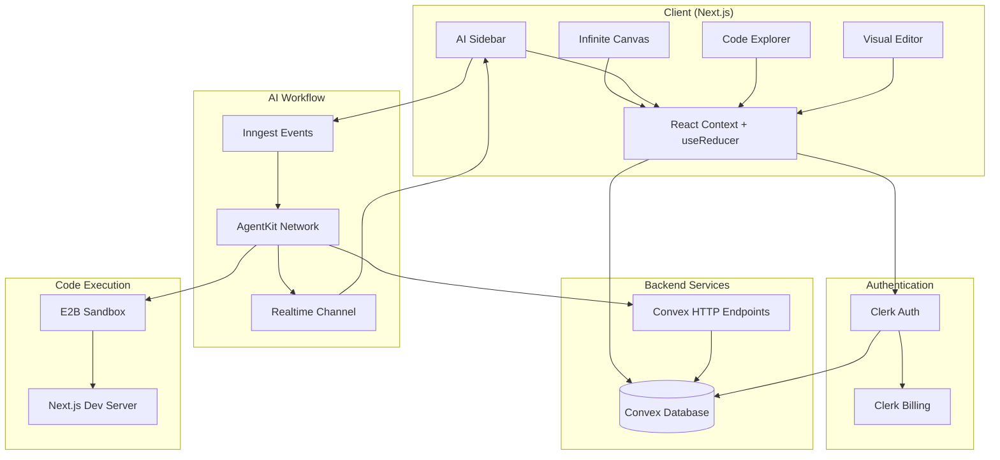
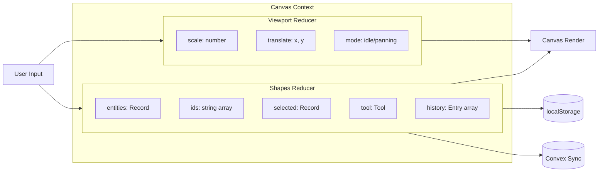
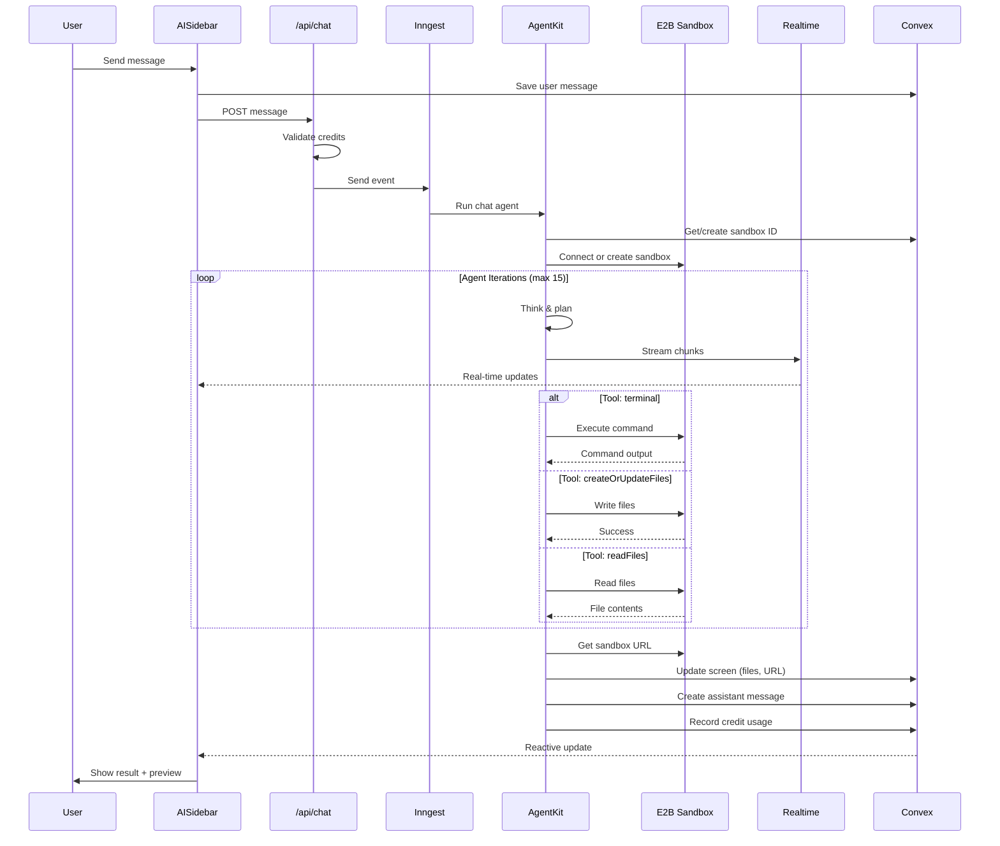
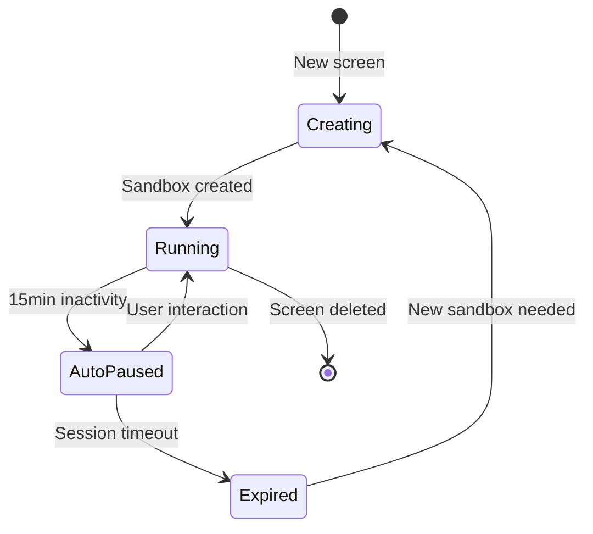
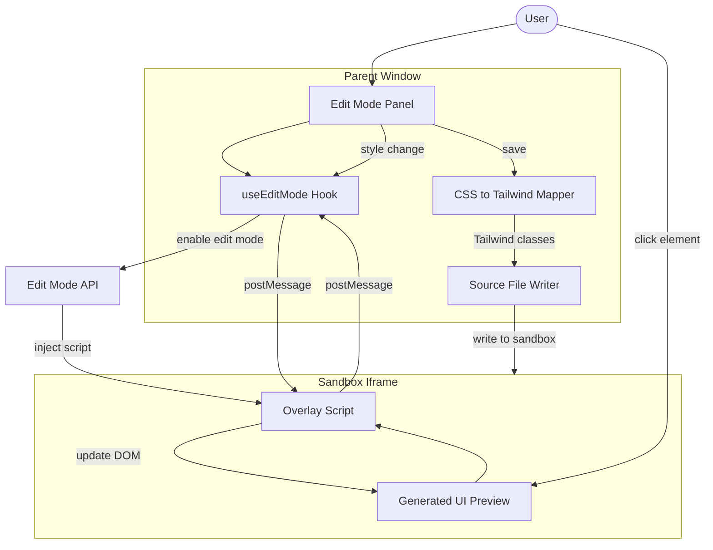
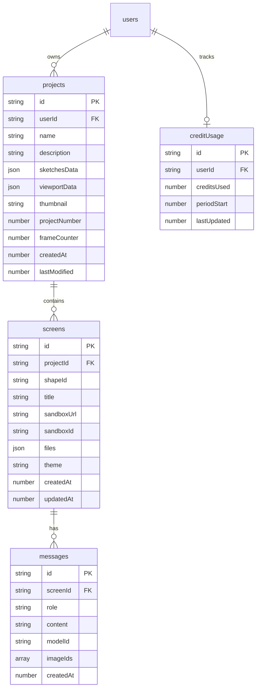
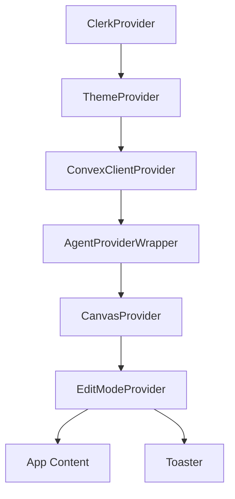
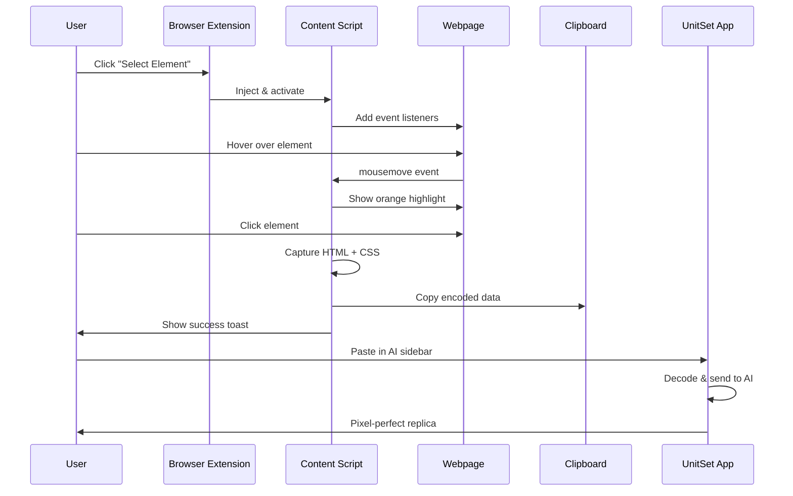
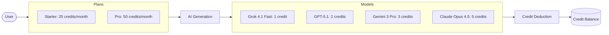

<p align="center">
  
</p>

<p align="center">
  <strong>AI-Powered Design-to-Code Platform</strong>
</p>

<p align="center">
  Transform wireframes into production-ready web applications using the power of AI.
</p>

<p align="center">
  <a href="#features">Features</a> •
  <a href="#tech-stack">Tech Stack</a> •
  <a href="#architecture">Architecture</a> •
  <a href="#browser-extension">Extension</a> •
  <a href="#getting-started">Getting Started</a> •
  <a href="#api-reference">API Reference</a>
</p>

---

## Overview

UnitSet is a revolutionary design platform that bridges the gap between design and development. Users can sketch wireframes on an infinite canvas, then leverage AI agents to transform those sketches into fully functional, production-ready Next.js applications—all within a single, unified environment.

The platform combines a Figma-like drawing experience with powerful AI code generation, real-time preview, visual editing capabilities, and a browser extension for capturing elements from any website.

---

## Features

### 🎨 Infinite Canvas

A professional-grade drawing environment with Figma-like interactions:

- **Drawing Tools**: Frames, rectangles, ellipses, lines, arrows, freehand drawing, and text
- **Pan & Zoom**: Middle-click drag, Space+drag, Ctrl/Cmd+wheel zoom around cursor
- **Selection**: Click, Shift+click multi-select, drag selection box
- **Manipulation**: Move, resize with 8-point handles, copy/paste
- **History**: Full undo/redo with Ctrl/Cmd+Z/Y
- **Layers**: Sidebar with shape reordering and visibility
- **Auto-save**: Debounced persistence to localStorage and cloud

### 🤖 AI-Powered Code Generation

Transform designs into functional applications:

- **Multi-Model Support**: Choose from Grok, GPT-5.1, Claude Opus 4.5, or Gemini 3 Pro
- **Real-Time Streaming**: Watch the AI think and code in real-time
- **Isolated Sandboxes**: Each generation runs in a secure E2B sandbox
- **Session Persistence**: Sandbox sessions persist for iterative development
- **Vision Support**: Attach images for vision-capable models
- **Conversation History**: Full chat history per screen for context

### ✏️ Visual Edit Mode

Edit generated UI without touching code:

- **Click-to-Select**: Click any element in the preview to select it
- **Style Controls**: Modify colors, spacing, typography, borders
- **CSS-to-Tailwind**: Automatic conversion of style changes to Tailwind classes
- **Source Updates**: Changes are written back to the actual source files

### 📁 Code Explorer

Browse and understand generated code:

- **File Tree**: Navigate the complete project structure
- **Syntax Highlighting**: Shiki-powered code viewing
- **Cached Content**: Instant access to generated files

### 🎭 Theme System

Multiple visual themes for generated applications:

- **Presets**: Default, Claude, Vercel, Cyberpunk, and more
- **Per-Screen Themes**: Each screen can have its own theme
- **Semantic Colors**: Theme-aware color system using CSS variables

### 🔌 Browser Extension

Capture elements from any website for AI replication:

- **Element Selector**: Click any element on any webpage
- **Visual Highlighting**: Orange outline shows selected element
- **Auto-Copy**: Captured HTML, CSS, and metadata copied to clipboard
- **Paste to Replicate**: Paste in UnitSet AI sidebar for pixel-perfect replication

### 💳 Credit-Based Billing

Fair usage with Clerk Billing:

- **Starter Plan**: 25 credits/month
- **Pro Plan**: 50 credits/month
- **Model Pricing**: 1-5 credits per generation based on model

### 🔐 Authentication

Secure access with Clerk:

- **Social Login**: Google, GitHub, and more
- **Session Management**: Secure JWT-based sessions
- **Convex Integration**: Seamless auth sync with backend

---

## Tech Stack

### Core Framework

| Technology       | Version | Purpose                                   |
| ---------------- | ------- | ----------------------------------------- |
| **Next.js**      | 16.0.2  | App Router, Server Components, API Routes |
| **React**        | 19.2.0  | UI rendering with latest features         |
| **TypeScript**   | 5.x     | Type-safe development                     |
| **Tailwind CSS** | 4.x     | Utility-first styling                     |

### Backend & Database

| Technology  | Purpose                                                |
| ----------- | ------------------------------------------------------ |
| **Convex**  | Real-time database, queries, mutations, HTTP endpoints |
| **Inngest** | Background job orchestration, event-driven workflows   |
| **E2B**     | Isolated sandbox environments for code execution       |

### AI & Streaming

| Technology             | Purpose                           |
| ---------------------- | --------------------------------- |
| **Inngest AgentKit**   | AI agent framework with tools     |
| **@inngest/realtime**  | Real-time event streaming         |
| **@inngest/use-agent** | React hooks for agent interaction |
| **OpenRouter**         | Multi-model AI API gateway        |

### Authentication & Billing

| Technology        | Purpose                         |
| ----------------- | ------------------------------- |
| **Clerk**         | Authentication, user management |
| **Clerk Billing** | B2C subscription management     |

### UI Components

| Technology        | Purpose                      |
| ----------------- | ---------------------------- |
| **shadcn/ui**     | 60+ accessible UI components |
| **Radix UI**      | Headless UI primitives       |
| **Lucide React**  | Icon library                 |
| **Framer Motion** | Animations and transitions   |

### Utilities

| Library        | Purpose                      |
| -------------- | ---------------------------- |
| **Shiki**      | Syntax highlighting          |
| **Streamdown** | Streaming markdown rendering |
| **nanoid**     | Unique ID generation         |
| **date-fns**   | Date manipulation            |
| **zod**        | Schema validation            |
| **Sonner**     | Toast notifications          |
| **Recharts**   | Data visualization           |

---

## Architecture

### High-Level System Overview



### Canvas State Management



**Key Design Decisions:**

1. **Normalized Entity State**: Shapes stored as `{ ids: string[], entities: Record<string, Shape> }` for O(1) lookups
2. **Separate Reducers**: Viewport and shapes have independent reducers for clean separation
3. **Refs for Interaction State**: Draft shapes, movement, and resize data stored in refs to prevent re-renders
4. **RAF Throttling**: Freehand drawing throttled to 8ms intervals for smooth performance
5. **History Batching**: Move/resize operations batched into single undo entries

**Shape Types:**

```typescript
type Shape =
  | FrameShape // Rectangular frames with auto-numbering
  | RectShape // Basic rectangles
  | EllipseShape // Ellipses/circles
  | FreeDrawShape // Freehand paths
  | ArrowShape // Arrows with endpoints
  | LineShape // Straight lines
  | TextShape // Text with typography controls
  | ScreenShape; // AI-generated UI previews
```

---

### AI Workflow Architecture



**Agent Tools:**

| Tool                  | Description                                   |
| --------------------- | --------------------------------------------- |
| `terminal`            | Execute shell commands (npm install, ls, cat) |
| `createOrUpdateFiles` | Write files to the sandbox                    |
| `readFiles`           | Read file contents from sandbox               |

**Sandbox Lifecycle:**



---

### Visual Edit Mode Architecture



**Style Mapping Example:**

```typescript
// Input: CSS style changes
{ fontSize: "18px", backgroundColor: "#3b82f6", padding: "16px" }

// Output: Tailwind classes
["text-lg", "bg-[#3b82f6]", "p-4"]
```

---

### Data Model



---

### Provider Hierarchy



---

## Browser Extension

The UnitSet Browser Extension allows you to capture any HTML element from any website and replicate it using AI.

### Features

- **Visual Element Selection**: Hover over elements to highlight them with an orange outline
- **One-Click Capture**: Click to capture the element's HTML, computed CSS styles, and metadata
- **Auto-Copy to Clipboard**: Captured data is automatically encoded and copied
- **Size Validation**: Elements over 100KB show a warning to select smaller components
- **Keyboard Support**: Press Escape to cancel selection mode

### How It Works



### Captured Data Structure

```typescript
interface CapturedElement {
  version: string; // "1.0"
  type: string; // "element_capture"
  timestamp: number;
  data: {
    html: string; // outerHTML of element
    styles: {
      // Computed CSS for element + descendants
      [selector: string]: Record<string, string>;
    };
    metadata: {
      tagName: string;
      dimensions: { width: number; height: number };
      position: { top: number; left: number };
      childCount: number;
      textContent: string | null;
    };
  };
}
```

### Installation

1. Navigate to `unitset-extension/`
2. Run `pnpm install && pnpm build`
3. Open Chrome → Extensions → Enable Developer Mode
4. Click "Load unpacked" → Select `unitset-extension/dist/`

### Usage

1. Click the UnitSet extension icon in your browser
2. Click "Select Element"
3. Hover over any element on the page (orange highlight appears)
4. Click to capture (automatically copied to clipboard)
5. Go to UnitSet canvas, open AI sidebar
6. Paste the captured data
7. AI will generate a pixel-perfect replica

---

## Getting Started

### Prerequisites

- Node.js 20+
- pnpm 8+
- Convex account
- Clerk account
- E2B account
- OpenRouter API key

### Environment Variables

Create a `.env.local` file:

```env

NEXT_PUBLIC_CLERK_PUBLISHABLE_KEY=
NEXT_PUBLIC_CLERK_SIGN_UP_URL=/sign-up
NEXT_PUBLIC_CLERK_SIGN_IN_URL=/sign-in
CLERK_SECRET_KEY=
CLERK_SIGN_UP_FALLBACK_REDIRECT_URL=/dashboard
CLERK_SIGN_IN_FALLBACK_REDIRECT_URL=/dashboard
CLERK_JWT_ISSUER_DOMAIN=

OPENROUTER_API_KEY=

E2B_API_KEY=

INNGEST_EVENT_KEY=
INNGEST_SIGNING_KEY=

CONVEX_DEPLOYMENT=
NEXT_PUBLIC_CONVEX_URL=

```

### Installation

```bash
# Clone the repository
git clone https://github.com/your-org/unitset.git
cd unitset

# Install dependencies
pnpm install

# Start Convex dev server (terminal 1)
npx convex dev

# Start Inngest dev server (terminal 2)
npx inngest-cli@latest dev -u http://localhost:3000/api/inngest

# Start Next.js dev server (terminal 3)
pnpm dev
```

### Build for Production

```bash
# Build the application
pnpm build

# Start production server
pnpm start
```

---

## API Reference

### Chat API

**POST `/api/chat`**

Send a message to the AI agent.

```typescript
// Request (useAgents format)
{
  userMessage: {
    id: string,
    content: string,
    role: "user",
    state?: {
      screenId: string,
      projectId: string,
      modelId?: string,
      imageUrls?: string[]
    }
  },
  threadId: string,
  history: Message[],
  userId?: string,
  channelKey?: string
}

// Response
{
  success: true,
  threadId: string,
  eventId: string
}

// Error Response (402 - Insufficient Credits)
{
  error: string,
  creditError: {
    code: "INSUFFICIENT_CREDITS" | "NO_SUBSCRIPTION",
    message: string,
    remaining: number,
    required: number,
    upgradeUrl: string
  }
}
```

### Realtime Token API

**POST `/api/realtime/token`**

Generate a subscription token for real-time streaming.

```typescript
// Request
{ channelKey: string }

// Response
{ token: string, ... }
```

### Sandbox APIs

| Endpoint                         | Method | Description                     |
| -------------------------------- | ------ | ------------------------------- |
| `/api/sandbox/files`             | GET    | List files in sandbox directory |
| `/api/sandbox/files/content`     | GET    | Read file content               |
| `/api/sandbox/resume`            | POST   | Resume paused sandbox           |
| `/api/sandbox/theme`             | POST   | Apply theme to sandbox          |
| `/api/sandbox/edit-mode/enable`  | POST   | Enable visual edit mode         |
| `/api/sandbox/edit-mode/disable` | POST   | Disable visual edit mode        |

### Convex HTTP Endpoints

Internal endpoints for Inngest workflow:

| Endpoint                     | Method | Description                     |
| ---------------------------- | ------ | ------------------------------- |
| `/inngest/updateScreen`      | POST   | Update screen with sandbox data |
| `/inngest/createMessage`     | POST   | Create assistant message        |
| `/inngest/getScreen`         | POST   | Get screen with sandboxId       |
| `/inngest/getMessages`       | POST   | Get message history             |
| `/inngest/recordCreditUsage` | POST   | Record credit deduction         |
| `/inngest/getCreditUsage`    | POST   | Get user's credit usage         |

---

## Project Structure

```
unitset/
├── app/                          # Next.js App Router
│   ├── (auth)/                   # Auth routes (sign-in, sign-up)
│   ├── api/                      # API routes
│   │   ├── chat/                 # Chat endpoint
│   │   ├── inngest/              # Inngest webhook
│   │   ├── realtime/             # Realtime token
│   │   └── sandbox/              # Sandbox management
│   ├── dashboard/                # Dashboard pages
│   │   └── [projectId]/canvas/   # Canvas page
│   └── pricing/                  # Pricing page
│
├── components/
│   ├── ai-elements/              # AI UI components (30+)
│   ├── canvas/                   # Canvas components
│   │   ├── shapes/               # Shape renderers
│   │   ├── property-controls/    # Property editors
│   │   ├── code-explorer/        # Code browser
│   │   └── edit-mode/            # Visual editor
│   ├── dashboard/                # Dashboard components
│   ├── landing/                  # Landing page
│   └── ui/                       # shadcn/ui (60+)
│
├── contexts/                     # React Context providers
│   ├── CanvasContext.tsx         # Canvas state
│   └── EditModeContext.tsx       # Edit mode state
│
├── convex/                       # Convex backend
│   ├── schema.ts                 # Database schema
│   ├── projects.ts               # Project queries/mutations
│   ├── screens.ts                # Screen queries/mutations
│   ├── messages.ts               # Message queries/mutations
│   ├── credits.ts                # Credit tracking
│   └── http.ts                   # HTTP endpoints
│
├── hooks/                        # Custom React hooks
│   ├── use-infinite-canvas.ts    # Main canvas hook
│   ├── use-chat-streaming.ts     # AI chat hook
│   ├── use-edit-mode.ts          # Visual edit hook
│   ├── use-code-explorer.ts      # Code browser hook
│   └── use-credit-balance.ts     # Credit tracking
│
├── inngest/                      # Inngest AI workflow
│   ├── client.ts                 # Inngest client
│   ├── functions.ts              # Agent functions
│   ├── realtime.ts               # Channel definitions
│   └── utils.ts                  # Sandbox utilities
│
├── lib/                          # Utilities
│   ├── canvas/                   # Canvas utilities
│   ├── edit-mode/                # Edit mode utilities
│   ├── ai-models.ts              # AI model config
│   ├── credits.ts                # Credit system
│   └── utils.ts                  # General utilities
│
├── sandbox-templates/            # E2B templates
│   └── nextjs/                   # Next.js sandbox
│
├── unitset-extension/            # Browser extension
│   ├── src/
│   │   ├── content/              # Content scripts
│   │   │   ├── element-selector.ts
│   │   │   └── capture.ts
│   │   ├── App.tsx               # Popup UI
│   │   └── types/                # TypeScript types
│   ├── public/
│   │   └── manifest.json         # Extension manifest
│   └── dist/                     # Built extension
│
└── types/                        # TypeScript types
    ├── canvas.ts                 # Canvas types
    └── project.ts                # Project types
```

---

## Keyboard Shortcuts

### Canvas

| Shortcut               | Action              |
| ---------------------- | ------------------- |
| `S`                    | Select tool         |
| `H`                    | Hand tool           |
| `F`                    | Frame tool          |
| `R`                    | Rectangle tool      |
| `C`                    | Ellipse tool        |
| `L`                    | Line tool           |
| `A`                    | Arrow tool          |
| `D`                    | Freedraw tool       |
| `T`                    | Text tool           |
| `E`                    | Eraser tool         |
| `Space`                | Temporary hand tool |
| `Delete` / `Backspace` | Delete selected     |
| `Ctrl/Cmd + Z`         | Undo                |
| `Ctrl/Cmd + Shift + Z` | Redo                |
| `Ctrl/Cmd + Y`         | Redo                |
| `Ctrl/Cmd + C`         | Copy                |
| `Ctrl/Cmd + V`         | Paste               |

### Zoom

| Shortcut           | Action             |
| ------------------ | ------------------ |
| `Ctrl/Cmd + Wheel` | Zoom around cursor |
| `Wheel`            | Pan vertically     |
| `Shift + Wheel`    | Pan horizontally   |

### Extension

| Shortcut | Action                   |
| -------- | ------------------------ |
| `Escape` | Cancel element selection |

---

## AI Models

| Model                         | Provider  | Vision | Credits |
| ----------------------------- | --------- | ------ | ------- |
| `x-ai/grok-4.1-fast:free`     | xAI       | No     | 1       |
| `openai/gpt-5.1`              | OpenAI    | Yes    | 2       |
| `google/gemini-3-pro-preview` | Google    | Yes    | 3       |
| `anthropic/claude-opus-4.5`   | Anthropic | Yes    | 5       |

---

## Credit System



Credits reset on the 1st of each month. Low credit warning appears at 5 credits remaining.

---

## Contributing

1. Fork the repository
2. Create a feature branch: `git checkout -b feature/amazing-feature`
3. Commit changes: `git commit -m 'Add amazing feature'`
4. Push to branch: `git push origin feature/amazing-feature`
5. Open a Pull Request

---

## License

This project is licensed under the Apache License 2.0 - see the [LICENSE](LICENSE) file for details.

---

<p align="center">
  Built with ❤️ by Adithya Vardhan
</p>
